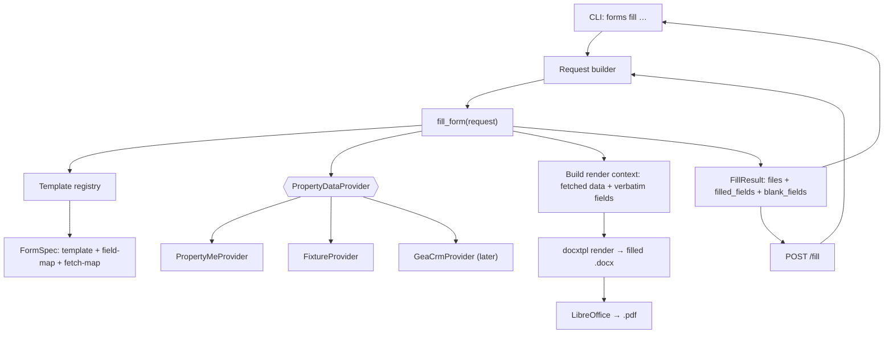
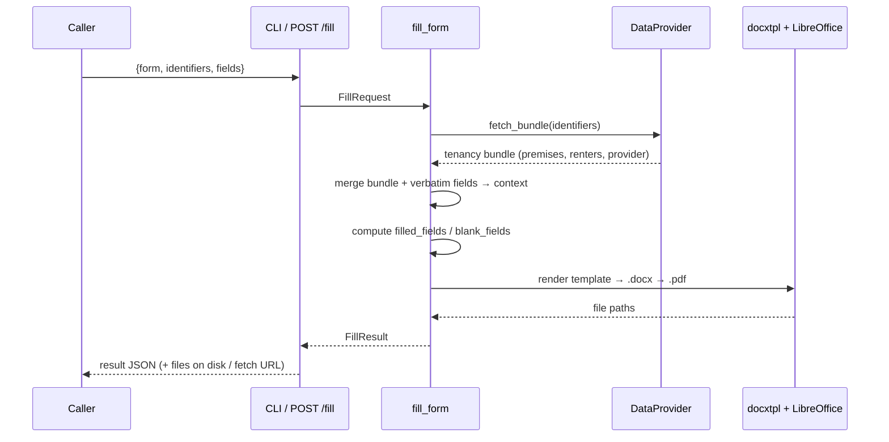

# feat: Forms-fill tool — CLI + POST /fill sharing one core

## Summary

Build a headless **forms-fill service** that takes a single payload of `{form, identifiers, fields}`, fetches the tenancy/property/people details from a swappable data provider, fills a known form template, and writes **PDF (primary) + DOCX** to an output directory while printing a machine-readable result JSON. The same fill core is exposed two ways: a non-interactive **CLI** (`forms fill …`) and an **HTTP `POST /fill`** endpoint. The first and only working form is the CAV "Notice of proposed rent increase to renter of rented premises" (RTA 1997 s44(1)). A **template-registry** pattern makes future forms (VCAT, inspection) additive.

The tool renders caller-supplied rent figures **verbatim** and owns **no** statutory logic — date computation, eligibility, delivery, and signing all stay with the caller / PM. The data provider is an interface: **PropertyMe first, GEA CRM later**, swapped with no change to the fill core (see `docs/integrations/crm-data-contract-prompt.md` for the shared data contract).

---

## Problem Frame

Our rent-review automation needs to produce a finished, filled CAV rent-increase notice **headlessly, with no human in the loop**, and get back a draft document an agent later reviews, completes (delivery/signature), and serves manually. Today there is no tool that turns `(identifiers + rent figures)` into a filled form. Property/tenant/owner data lives in PropertyMe (and later GEA CRM); the rent figures and the legally-computed start date are supplied by the caller.

Two facts discovered during planning shape the design:

1. **The CAV template has no fillable form fields for text.** Inspection of the `.docx` shows 0 `FORMTEXT` fields and 0 content controls — renter/provider/premises values sit in plain table cells beside their labels. There are **13 legacy `FORMCHECKBOX` fields** (all named `MethodCheck1`) for the week/fortnight/calendar-month ticks, addressable only by document order. Filling therefore means **inserting text into the correct cells and toggling the correct checkboxes**, which motivates a one-time **template-preparation** step (convert the original into a placeholder-bearing template) rather than fragile positional surgery on every run.
2. **PropertyMe is not yet integrated.** The CRM's `propertyme.ts` is a stub (`TODO: implement once PropertyMe API documentation is reviewed`). There is no working client to reuse. This makes the provider boundary a first-class abstraction with a fixture provider so the CAV fill is end-to-end testable today.

---

## Requirements

Traced from the request.

- **R1** — Accept input as CLI flags (`--form`, `--identifiers`, `--fields`, `--out`) **and** as a single JSON payload (`--json '{…}'` or stdin). All three forms map to one internal request object.
- **R2** — Run fully non-interactively. Exit `0` on success; exit non-zero with a clear **stderr** message on failure.
- **R3** — Keep two input classes separate: **`fields`** (caller-authoritative, rendered verbatim — `current_rent`, `new_rent`, `increase`, `rent_period`, `start_date`, `method_basis`) and **`identifiers`** (`lot_id`, `tenancy_id` → fetched from the data provider).
- **R4** — Never compute or validate dates, eligibility, or any statutory logic.
- **R5** — Fetch and fill: premises address + postcode; renter full names (4 slots, overflow note if >4); renter address-for-service, contact, email (may be blank); rental provider **owner** full name (never the agent); provider service address + contact (agency address allowed).
- **R6** — Map values to the correct controls: tick the right week/fortnight/calendar-month checkbox for **each** rent figure; place `method_basis` in the "Method used to calculate the rent increase" field.
- **R7** — Leave blank: the "Delivery of this notice" section, the signature-block date, and the renter's "Rent increase investigation" section.
- **R8** — Output **PDF (primary) + DOCX** to `--out`, and print result JSON to stdout: `{ ok, form, files:{docx,pdf}, filled_fields, blank_fields }`.
- **R9** — Report which fields came back blank (e.g. `renter2_email`) so the calling system can warn the PM.
- **R10** — Expose `POST /fill` taking the same JSON payload, returning the same result plus a way to fetch the generated files. CLI and API **must share one fill function**.
- **R11** — Template-registry pattern: a form is `{template, field-map, fetch-mapping}` registered under a key (`cav_rent_increase_notice`); adding a form means adding a template + mapping, not changing the core.
- **R12** — Data provider is a swappable interface (PropertyMe now, GEA CRM later) conforming to the contract in `docs/integrations/crm-data-contract-prompt.md`.
- **R13** — Deliverables: the CLI, `POST /fill`, a README with both invocation styles and a worked CAV example, and confirmation of the exact `fields`/`identifiers` JSON keys the rent-review system wires to.

---

## Key Technical Decisions

- **KTD1 — Python, as a new package in this repo.** A new top-level `forms_fill/` package in `GEA_formsAI`. Python gives the cleanest DOCX→PDF path (docxtpl + LibreOffice), and FastAPI already exists in the repo. Rationale over TypeScript: DOCX templating + PDF rendering in Node still shells out to LibreOffice anyway, so Python removes a layer. The package is self-contained (its own entry points, deps, Dockerfile) so it can deploy to Railway independently of Slate/the experimental backend.
- **KTD2 — Prepared docxtpl Jinja template, not per-run positional surgery.** A one-time **template-prep** step converts the original CAV `.docx` into `templates/cav_rent_increase_notice/template.docx` with Jinja placeholders in the right cells (`{{ premises.address_line }}`, `☒`-style checkbox glyphs, etc.). Runtime fill is then a clean `docxtpl.render(context)`. This is robust to Word's lack of named text fields and is what makes the registry pattern tidy. The 13 legacy `FORMCHECKBOX` controls are replaced during prep with template-controlled tick glyphs so checkbox state is deterministic.
- **KTD3 — LibreOffice headless for PDF.** Render DOCX→PDF via `soffice --headless --convert-to pdf`. It is the only dependable high-fidelity converter for complex Word tables. This becomes a runtime/deploy dependency (must be present in the Docker image for Railway). PDF is primary; the DOCX is always kept.
- **KTD4 — `PropertyDataProvider` interface with PropertyMe + Fixture adapters now.** The fill core depends on an abstract provider returning the `tenancy-bundle` shape from the data contract. `FixtureProvider` (reads local JSON) makes the CAV path end-to-end testable today; `PropertyMeProvider` targets `app.propertyme.com/api/v2` with `PROPERTYME_API_KEY`. A `GeaCrmProvider` is a later additive adapter against the same contract. Provider is selected by env/flag (`FORMS_DATA_PROVIDER`).
- **KTD5 — One `fill_form()` core; CLI and API are thin shells.** Both the CLI and `POST /fill` build the same `FillRequest`, call the same `fill_form(request) -> FillResult`, and serialise the same result. No business logic lives in either shell.
- **KTD6 — `blank_fields` is computed from the resolved context, not guessed.** After fetching + merging, the core walks the form's declared field set and records every declared field that resolved empty. This drives both the JSON report (R9) and the `filled_fields` count.

---

## High-Level Technical Design

### Component / data flow



### Request lifecycle



The CAV checkbox mapping (R6): each rent figure (`current_rent`, `new_rent`, `increase`) has its own week/fortnight/calendar-month row; `rent_period` selects which box is ticked **in all three rows**, since one period applies to the whole notice.

---

## Output Structure

```
forms_fill/
├── README.md                         # both invocation styles + worked CAV example (R13)
├── pyproject.toml                    # deps: docxtpl, fastapi, uvicorn, typer, httpx, pydantic
├── Dockerfile                        # python + libreoffice for Railway
├── forms_fill/
│   ├── __init__.py
│   ├── core.py                       # fill_form(request) -> FillResult  (THE shared core)
│   ├── models.py                     # FillRequest, FillResult, TenancyBundle (pydantic)
│   ├── registry.py                   # FORM_REGISTRY: key -> FormSpec
│   ├── render.py                     # docxtpl render + LibreOffice PDF
│   ├── cli.py                        # `forms` CLI (typer) — thin shell
│   ├── api.py                        # FastAPI app, POST /fill + GET /files — thin shell
│   ├── providers/
│   │   ├── base.py                   # PropertyDataProvider ABC + select_provider()
│   │   ├── fixture.py                # FixtureProvider (local JSON)
│   │   └── propertyme.py             # PropertyMeProvider (v2 API)
│   └── forms/
│       └── cav_rent_increase_notice/
│           ├── spec.py               # FormSpec: template path, field map, fetch map, declared fields
│           └── template.docx         # prepared Jinja template (from the original CAV docx)
├── fixtures/
│   └── sample_tenancy.json           # matches the data contract; powers tests + README example
└── tests/
    ├── test_core_fill.py
    ├── test_cli.py
    ├── test_api.py
    ├── test_registry.py
    ├── test_providers.py
    └── test_cav_spec.py
```

---

## Implementation Units

### U1. Package scaffold, models, and request normalisation

**Goal:** Stand up the `forms_fill/` package and the one request shape that all three input styles normalise into.
**Requirements:** R1, R3.
**Dependencies:** none.
**Files:** `forms_fill/pyproject.toml`, `forms_fill/forms_fill/__init__.py`, `forms_fill/forms_fill/models.py`, `forms_fill/tests/test_models.py` (new).
**Approach:** Define pydantic models — `FillRequest{ form: str, identifiers: dict, fields: dict, out_dir: str }`, `FillResult{ ok, form, files: {docx, pdf}, filled_fields: int, blank_fields: list[str] }`, and `TenancyBundle` mirroring the data contract (`premises`, `renters[]`, `rental_provider`, `meta`). Add a `build_request()` that accepts either the split form (`--form/--identifiers/--fields/--out`) or a single JSON object and produces one `FillRequest`. Keep `fields` and `identifiers` as distinct keys end-to-end (R3) — never merge them.
**Patterns to follow:** pydantic usage in the existing Slate/CRM code (Zod-equivalent discipline); model-per-file separation seen in `slate/src/types/`.
**Test scenarios:**
- Happy: split-flag inputs and equivalent `--json` payload produce an identical `FillRequest`.
- Edge: `fields` and `identifiers` keys with overlapping names stay in their own buckets.
- Error: malformed JSON in `--json`/stdin raises a typed validation error (surfaced as stderr later).
- Edge: unknown top-level keys are rejected (strict models) so contract drift is caught.
**Verification:** `build_request()` round-trips both input styles to one object; models reject malformed payloads.

### U2. Template registry + CAV FormSpec (declared fields + mappings)

**Goal:** A registry keyed by form name returning a `FormSpec`, and the CAV spec that declares its fields and how bundle/`fields` map into the render context.
**Requirements:** R5, R6, R7, R11.
**Dependencies:** U1.
**Files:** `forms_fill/forms_fill/registry.py`, `forms_fill/forms_fill/forms/cav_rent_increase_notice/spec.py`, `forms_fill/tests/test_registry.py`, `forms_fill/tests/test_cav_spec.py` (new).
**Approach:** `FormSpec` carries: template path, `declared_fields` (the full set the form can fill — drives `blank_fields`), a `build_context(bundle, fields)` that produces the docxtpl context, and the checkbox logic for R6. CAV spec maps premises/renters(1–4)/provider into cells, sets `method_basis` into the method field, and ticks the `rent_period` box for each of the three rent rows. Encodes R7 explicitly: delivery section, signature date, and rent-increase-investigation fields are **not** in `declared_fields` and are never written. >4 renters → set an `overflow_note` flag for the template. `FORM_REGISTRY = {"cav_rent_increase_notice": cav_spec}`; unknown form key raises a clear error.
**Patterns to follow:** registry-by-key like the detection-method maps in `slate/src/components/fill/FieldsPanel.tsx` (`METHOD_LABELS`).
**Test scenarios:**
- Happy: CAV context contains premises/renter/provider values in the expected template variables.
- Happy (R6): `rent_period="fortnight"` ticks the fortnight box in all three rent rows and leaves week/calendar-month unticked.
- Edge: 5 renters → first 4 fill slots and `overflow_note` is set.
- Edge (R7): delivery/signature-date/investigation fields never appear in the context or declared fields.
- Error: unknown form key raises a registry error naming the available forms.
**Verification:** Registry resolves the CAV key; context honours checkbox mapping and the leave-blank rule.

### U3. PropertyDataProvider interface + Fixture and PropertyMe adapters

**Goal:** The swappable fetch boundary, with a fixture provider (testable today) and a PropertyMe adapter against v2.
**Requirements:** R5, R12.
**Dependencies:** U1.
**Files:** `forms_fill/forms_fill/providers/base.py`, `forms_fill/forms_fill/providers/fixture.py`, `forms_fill/forms_fill/providers/propertyme.py`, `forms_fill/fixtures/sample_tenancy.json`, `forms_fill/tests/test_providers.py` (new).
**Approach:** `PropertyDataProvider` ABC with `fetch_bundle(identifiers) -> TenancyBundle`. `select_provider()` reads `FORMS_DATA_PROVIDER` (`fixture` default in dev/test, `propertyme` in prod). `FixtureProvider` loads `fixtures/sample_tenancy.json` (matches the data contract). `PropertyMeProvider` uses `httpx` against `PROPERTYME_BASE_URL` (default `https://app.propertyme.com/api/v2`) with `PROPERTYME_API_KEY`, resolving `lot_id`/`tenancy_id` → premises + renters + **owner** (never agent) and normalising into `TenancyBundle`. Missing per-field values become `""`/`null`, never dropped (contract rule). The exact PropertyMe endpoint paths/JSON are an execution-time unknown (see Deferred) — keep the normalisation seam isolated so only the mapping function changes once the API is confirmed.
**Execution note:** Write the FixtureProvider and the bundle-normalisation contract test first; they pin the shape the PropertyMe mapping must satisfy.
**Test scenarios:**
- Happy: FixtureProvider returns a fully-populated `TenancyBundle` from the sample JSON.
- Edge: bundle with blank renter email / blank after-hours phone preserves the keys as empty.
- Edge: `provider.full_name` is sourced from the owner, not the agent (guard test on mapping).
- Error: `select_provider("propertyme")` with no `PROPERTYME_API_KEY` raises a clear config error.
- Error: PropertyMe HTTP 404 for an unknown tenancy surfaces a typed not-found error.
**Verification:** Fixture path returns a contract-shaped bundle; provider selection + missing-key handling behave as specified.

### U4. Render pipeline — docxtpl fill + LibreOffice PDF + blank-field accounting

**Goal:** Turn a render context into a filled DOCX and a PDF, and compute `filled_fields`/`blank_fields`.
**Requirements:** R6, R8, R9, KTD6.
**Dependencies:** U2.
**Files:** `forms_fill/forms_fill/render.py`, `forms_fill/forms_fill/forms/cav_rent_increase_notice/template.docx` (prepared template), `forms_fill/tests/test_render.py` (new).
**Approach:** `render(spec, context, out_dir) -> {docx, pdf}` runs `docxtpl` to produce `<form>.docx`, then shells `soffice --headless --convert-to pdf --outdir <out_dir>` for the PDF. A separate **one-time template-prep** task (documented in README, not run at request time) creates `template.docx` from the original CAV `.docx`: replace the 13 legacy `FORMCHECKBOX` controls with template-driven tick glyphs and insert Jinja placeholders into the right cells. `compute_blank_fields(spec, context)` walks `declared_fields` and returns those resolved empty; `filled_fields = len(declared) - len(blank)`.
**Test scenarios:**
- Happy: rendering the fixture context yields a `.docx` and `.pdf` on disk; extracted DOCX text contains premises/renter/provider values.
- Happy (R9): a context missing `renter2_email` lists `renter2_email` in `blank_fields` and excludes it from `filled_fields`.
- Edge (R6): rendered DOCX shows exactly one ticked period box per rent row matching `rent_period`.
- Error: when `soffice` is unavailable, render raises a clear dependency error (DOCX still written).
- Integration: end-to-end fixture render → both files exist and the blank/filled counts match the declared set.
**Verification:** Fixture render produces both files with correct content, ticks, and blank/filled accounting.

### U5. Shared fill core — `fill_form(request)`

**Goal:** The single function CLI and API both call: resolve form, fetch bundle, build context, render, assemble result.
**Requirements:** R4, R5, R8, R10, KTD5, KTD6.
**Dependencies:** U2, U3, U4.
**Files:** `forms_fill/forms_fill/core.py`, `forms_fill/tests/test_core_fill.py` (new).
**Approach:** `fill_form(request, provider=None) -> FillResult`: look up `FormSpec` from the registry; fetch the bundle via the selected provider using `request.identifiers`; call `spec.build_context(bundle, request.fields)` (caller `fields` rendered verbatim — **no date/eligibility logic**, R4); render to `out_dir`; compute blank/filled; return `FillResult(ok=True, …)`. All errors raise typed exceptions carrying a clean message (shells convert to stderr/HTTP). This is the only place orchestration lives.
**Test scenarios:**
- Happy: fixture provider + valid CAV request returns `ok=True`, both file paths, correct `filled_fields`, and a `blank_fields` list.
- Happy (R4): caller `start_date`/rent figures appear verbatim in output; no value is recomputed or reformatted.
- Edge: >4 renters flows through to the overflow note in the document.
- Error: unknown form key / provider not-found / render failure each raise typed errors with clear messages.
- Integration: swapping FixtureProvider for a stubbed PropertyMeProvider changes only the data source, not the result shape.
**Verification:** One core call drives the whole pipeline and returns the contract result for the CAV form.

### U6. CLI shell — `forms fill`

**Goal:** A non-interactive CLI that builds a request, calls the core, prints result JSON, and uses exit codes.
**Requirements:** R1, R2, R8.
**Dependencies:** U5.
**Files:** `forms_fill/forms_fill/cli.py`, `forms_fill/pyproject.toml` (console-script entry `forms`), `forms_fill/tests/test_cli.py` (new).
**Approach:** `typer` app with `fill` accepting `--form`, `--identifiers` (JSON), `--fields` (JSON), `--out`, and `--json`/stdin for the whole payload. Build `FillRequest` via U1, call `fill_form`, print `FillResult` JSON to **stdout**, exit `0`. On any typed error, print a clear message to **stderr** and exit non-zero (R2). No prompts, no interactive fallback.
**Test scenarios:**
- Happy: split flags produce result JSON on stdout and exit `0`; files exist under `--out`.
- Happy: `--json`/stdin payload produces an identical result.
- Error: bad form key → non-zero exit, message on stderr, nothing on stdout.
- Error: malformed `--identifiers` JSON → non-zero exit with a clear parse message.
- Edge: `blank_fields` is present in the printed JSON for a fixture missing an email.
**Verification:** CLI runs headlessly, honours exit codes, and emits the result contract.

### U7. HTTP shell — `POST /fill` + file retrieval

**Goal:** Expose the same core over HTTP with a way to fetch generated files, for local or Railway use.
**Requirements:** R2, R8, R10.
**Dependencies:** U5.
**Files:** `forms_fill/forms_fill/api.py`, `forms_fill/Dockerfile`, `forms_fill/tests/test_api.py` (new).
**Approach:** FastAPI app; `POST /fill` accepts the same JSON payload, builds a `FillRequest` (writing to a per-request output dir), calls `fill_form`, returns the `FillResult` JSON augmented with retrieval URLs. `GET /files/{id}/{kind}` streams the `pdf`/`docx`. Errors map to non-2xx with a JSON message (R2 parity). Dockerfile installs Python deps **and LibreOffice** so PDF rendering works on Railway (KTD3).
**Test scenarios:**
- Happy: `POST /fill` with the fixture payload returns `ok=True`, file URLs, and correct counts.
- Happy: the returned PDF URL streams a non-empty `application/pdf`.
- Error: unknown form key → 4xx with a JSON error; render dependency failure → 5xx with a clear message.
- Integration: CLI and API produce byte-equivalent DOCX for the same fixture payload (shared-core proof, R10).
**Verification:** `POST /fill` mirrors the CLI result and serves the files; image carries LibreOffice.

### U8. README + key-contract confirmation

**Goal:** Document both invocation styles, a worked CAV example, the template-prep + registry process, and the exact accepted JSON keys.
**Requirements:** R11, R13.
**Dependencies:** U6, U7.
**Files:** `forms_fill/README.md`, `forms_fill/fixtures/sample_tenancy.json` (referenced) (new/modify).
**Approach:** README sections: quick start; CLI invocation (the worked `forms fill --form cav_rent_increase_notice …` example from the spec); `POST /fill` invocation with the same payload; the **exact** `identifiers` keys (`lot_id`, `tenancy_id`) and `fields` keys (`current_rent`, `new_rent`, `increase`, `rent_period` ∈ {`week`,`fortnight`,`calendar month`}, `start_date`, `method_basis`) with types — this is the wiring contract for the rent-review system (R13); how to add a new form (prepare template → write `spec.py` → register); link to `docs/integrations/crm-data-contract-prompt.md` for the provider contract.
**Test scenarios:** `Test expectation: none -- documentation unit; correctness is covered by the worked example matching tests in U6/U7.`
**Verification:** A reader can run both invocation styles from the README and knows the exact keys to send.

---

## Scope Boundaries

**In scope:** the CAV rent-increase notice fill; CLI + `POST /fill` sharing one core; PDF+DOCX output and the result JSON; fixture + PropertyMe providers; template-registry pattern; README + key contract.

**Out of scope (per request — caller/PM owns these):**
- Delivering or serving the form; signatures; the "Delivery of this notice" section.
- Any rent-review business logic; computing or validating legal dates or eligibility.
- The renter's "Rent increase investigation" section.

### Deferred to Follow-Up Work
- **GEA CRM provider** (`GeaCrmProvider`) against the same data contract — additive adapter once the CRM exposes `GET /api/forms/tenancy-bundle` (`docs/integrations/crm-data-contract-prompt.md`).
- **Real PropertyMe endpoint confirmation** — the exact v2 paths/JSON for resolving `lot_id`/`tenancy_id`; the normalisation seam isolates this.
- **Additional forms** (VCAT, inspection) — new templates + specs under the registry.
- **Auth on `POST /fill`** for shared/Railway deployment (shared-secret header), if exposed beyond a private network.

---

## Open Questions

- **PropertyMe v2 specifics** (endpoint paths, auth scheme, how `lot_id` vs `tenancy_id` resolve renters + owner) — unverified; the integration is currently a stub. Resolve at implementation against live API docs/key; until then the FixtureProvider is the working path.
- **`rent_period` wording** — the form prints "week / fortnight / calendar month". The spec example sends `"weekly"`; the README/contract will pin the accepted set to `week | fortnight | calendar month` and the CLI will normalise common synonyms (`weekly`→`week`). Confirm acceptable.

---

## Risks & Dependencies

- **LibreOffice as a runtime dependency** (KTD3) — must be in the Docker image and on dev machines; absence is the most likely failure. Mitigation: explicit dependency check with a clear error; Dockerfile installs it; DOCX is still produced even if PDF fails.
- **Template-prep fidelity** — replacing 13 unnamed legacy checkboxes and inserting placeholders by hand risks mis-mapping a tick to the wrong rent row. Mitigation: U4 render tests assert exactly one ticked box per row for a known `rent_period`; visual spot-check of the prepared template before first use.
- **PropertyMe owner-vs-agent** — the form legally forbids the agent's name in the provider field. Mitigation: provider mapping sources `full_name` from the owner explicitly; guard test in U3; the data contract states the rule.
- **Verbatim rendering (R4)** — a stray reformat of `start_date` or rent figures would silently corrupt a legal notice. Mitigation: U5 test asserts byte-for-byte passthrough of caller `fields`.

---

## Sources & Research

- CAV template inspected: `Notice of proposed rent increase to renter of rented premises.docx` — 0 FORMTEXT, 0 content controls, 13 `FORMCHECKBOX` (all `MethodCheck1`); values in table cells. Drives KTD2.
- `GEA_crmAI` `src/lib/sync/propertyme.ts` — PropertyMe sync is a stub (`TODO`), intended API `https://app.propertyme.com/api/v2` with `PROPERTYME_API_KEY`; auth pattern `x-sync-secret`/`SYNC_SECRET`. Drives KTD4 + the deferral.
- `GEA_crmAI` Prisma models (`ManagedProperty`, `Lease`, `Tenant`, `TenantLease`, `Contact` owner) — basis for the GEA CRM field mapping in the data contract.
- Data contract: `docs/integrations/crm-data-contract-prompt.md` (this repo).
