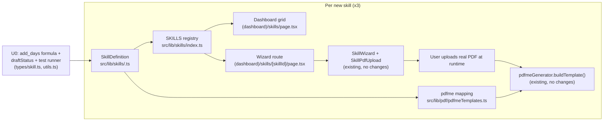

# feat: Sales authority skills (auction, exclusive, general) in Slate

**Target repo/dir:** `slate/` (Next.js 16 app, sibling of `forms_fill/` at repo root)

---

## Summary

Add 3 new Victoria real-estate sales-authority forms as Slate "skills" — Auction
Authority, Exclusive Sale Authority, and General (non-exclusive) Authority —
following the exact pattern of the 4 skills already shipped (Section 32,
Contract of Sale, Trust Reconciliation, Transfer of Land). Each skill is a
`SkillDefinition` + a pdfme coordinate map + a registry entry; the wizard UI,
PDF upload, and fill pipeline are already generic and require no changes.

---

## Problem Frame

Slate's roadmap (per user) is to cover GEA's key sales and property-management
forms. Property management already has the CAV rent-increase notice (separate
`forms_fill` CLI/API tool) and 4 unrelated skills exist in Slate for other
document types. No sales-authority form exists yet in either system. The user
chose to build these 3 as Slate skills (not the headless `forms_fill` tool),
matching where agents already work for similar documents.

**Assumption (confirmed with user):** no verbatim signed copy of any of the 3
forms is available yet. Field schemas are built from statutory structure
(Estate Agents Act 1980 (Vic)) and general REIV VicForms conventions,
researched via Consumer Affairs Victoria and industry sources (see Sources
below) rather than a literal form. The user will upload an actual signed PDF
per form to calibrate pdfme coordinates once available — this is the same
runtime-upload model the existing 4 skills already use (no PDF templates are
checked into the repo).

---

## Requirements

- **R1** — Add an "Auction Authority" skill: vendor/property/commission/
  marketing fields plus auction-specific fields (auction date, time, venue,
  reserve price, vendor bid disclosure), with the mandatory expiry rule
  (ends 30 days after the auction date).
- **R2** — Add an "Exclusive Sale Authority" skill: vendor/property/commission/
  marketing fields plus sole-agency clause and the mandatory 60-day private-sale
  expiry cap, plus optional post-expiry introduced-prospect tail clause field.
- **R3** — Add a "General (Non-Exclusive) Authority" skill: vendor/property/
  commission/marketing fields plus an explicit non-exclusivity clause and
  open-ended (no statutory cap) duration.
- **R4** — All 3 skills register in the existing `SKILLS` array so they appear
  in the dashboard grid and wizard route, using the same `SkillDefinition`
  shape as the 4 existing skills.
- **R5** — Each skill's pdfme coordinate map is a placeholder authored against
  the researched field list, structured so a follow-up calibration pass
  (once a real signed PDF is uploaded) only requires editing `position`/`page`
  values, not the field list itself.
- **R6** — Establish the first per-skill test convention (none exists yet) —
  schema/mapping-level unit tests — since this doubles as the pattern the next
  Slate skills (PM forms, VCAT) will follow.
- **R7** — Mark all 3 new skills as unverified drafts in the UI (not yet
  checked against a real signed form, and statutory day-counts not yet
  confirmed against primary legislation) until a human confirms otherwise.

**Out of scope:** wiring `forms_fill` and Slate together (user deferred this
in scoping); AI-extraction skills like `extractSection32.ts` (no reason to
build a bespoke extractor before a real form exists to extract from);
calibrating exact PDF coordinates against a real form (deferred until the user
uploads one — flagged as a Risk below, not a blocking dependency).

---

## Key Technical Decisions

**KTD1 — Follow the existing skill pattern exactly, no new abstractions.**
The 4 existing skills already generalize well (shared types in
`src/types/skill.ts`, shared wizard components, shared `SKILLS` registry).
Adding 3 more of the same shape is the lazy-correct move — no new registry
mechanism, no new UI, no new API routes needed.

**KTD2 — One skill definition file + one mapping export per form, matching
`section-32-offer.ts` / `SECTION_32_PDFME_MAPPINGS`.** Keeps each form's
field list and coordinate map co-located with its siblings in
`src/lib/pdf/pdfmeTemplates.ts`, consistent with how Contract of Sale and
Section 32 already live there together.

**KTD3 — Field schemas are structured, not verbatim.** Because the real form
text isn't available yet, field `id`/`label`/`type` values are named for
semantic clarity (e.g. `auctionDate`, `soleAgencyClause`) rather than copied
form field codes. This keeps the calibration follow-up (Risk R1 below) a
pure coordinate-mapping exercise — field names don't need to change once a
real PDF is uploaded, only `position`/`page` in the pdfme mapping.

**KTD4 — Duration/expiry logic is a computed field, requiring a small
extension to the existing mechanism.** Per research, Auction Authority and
Exclusive Authority both have a statutory expiry rule tied to another field
(auction date, or signing date). **Verified against the codebase:**
`SkillComputedField.formula` in `src/types/skill.ts` is currently typed as
literally `'subtract'` only, and `applyComputedFields()` in
`src/lib/skills/utils.ts` implements only two-numeric-operand subtraction
(used today for `balance_at_settlement = price - deposit`). There is no
date-arithmetic path. U0 (below) adds a new `'add_days'` formula variant,
additive to the existing type so the 4 shipped skills are unaffected, before
U1/U2 can use it.

**KTD5 — Draft/unverified status is a first-class field on the skill, not an
implicit convention.** Since field content is researched rather than
verbatim (R7), each new `SkillDefinition` carries an explicit
`draftStatus: 'unverified'`-style marker (exact shape decided in U0) that the
dashboard card and wizard header render as a visible notice, rather than
leaving "this hasn't been checked yet" as tribal knowledge.

---

## High-Level Technical Design

No new components or API routes are introduced. This is one small additive
extension to shared type/util files (U0), then 3 parallel additions into 2
existing files (skill definitions directory, `pdfmeTemplates.ts`) plus 1
shared registry file.

---

### U0. Shared foundation: date-offset computed fields, draft-status marker, test runner

**Goal:** Unblock U1-U4 by adding the one piece of real plumbing this plan
needs that doesn't exist yet: a date-offset computed-field formula, a
draft-status marker on `SkillDefinition`, and a configured test runner.
Surfaced by review as a P0 — without this unit, KTD4 and R6 cannot be
implemented as written.

**Requirements:** R6, R7, KTD4, KTD5

**Dependencies:** none

**Files:**
- `slate/src/types/skill.ts` (edit) — widen `SkillComputedField.formula` to
  `'subtract' | 'add_days'`, add `operands`/`days` shape for `add_days`; add
  an optional `draftStatus?: 'unverified' | 'verified'` field to
  `SkillDefinition`
- `slate/src/lib/skills/utils.ts` (edit) — add the `add_days` branch to
  `applyComputedFields()` alongside the existing `subtract` branch
- `slate/package.json` (edit) — add a test runner (vitest — lightest fit for
  a Next.js 16 + TS project with no existing Jest config) and a `test` script
- `slate/vitest.config.ts` (new) — minimal config pointing at `tests/unit/`
- `slate/tests/unit/skills/computed-fields.test.ts` (new)

**Approach:** `add_days` takes one date operand and one integer day-count
operand (or a literal day count), parses the date, adds the offset, returns
an ISO date string; missing/invalid source date returns `undefined` (mirrors
the existing `subtract` branch's blank-on-missing-input behavior). This is
additive only — the existing `subtract` branch and its 4 current call sites
are untouched, so shipped skills are unaffected. `draftStatus` is optional so
the 4 existing `SkillDefinition`s remain valid without edits (defaults to
treated-as-verified when absent).

**Patterns to follow:** the existing `subtract` branch in
`applyComputedFields()` — same input-validation and blank-on-missing shape.

**Test scenarios:**
- Happy path: `add_days('2026-09-15', 30)` returns the ISO date 30 days
  later.
- Edge case: missing/invalid source date — returns `undefined`, does not
  throw.
- Edge case: existing `subtract` formula still computes correctly after the
  type widening (regression check — the 4 shipped skills' computed fields,
  e.g. `balance_at_settlement`, are unaffected).
- `draftStatus` absence on an existing skill does not break type-checking or
  rendering (backward compatibility check).

**Verification:** `npm test` runs and passes via the newly configured
runner; type-checks with no `any`; existing 4 skills' computed fields still
compute correctly.

---

### U1. Auction Authority skill

**Goal:** Add the Auction Authority skill definition, field schema, and pdfme
coordinate placeholder, matching R1.

**Requirements:** R1, R5, R7, KTD2, KTD3, KTD4, KTD5

**Dependencies:** U0

**Files:**
- `slate/src/lib/skills/auction-authority.ts` (new) — `SkillDefinition`
- `slate/src/lib/pdf/pdfmeTemplates.ts` (edit) — add
  `AUCTION_AUTHORITY_PDFME_MAPPINGS` export
- `slate/tests/unit/skills/auction-authority.test.ts` (new)

**Approach:** Sections: Vendor Details, Property Details, Auction Details
(date, time, venue, reserve price, vendor bid disclosure), Commission &
Marketing Expenses, Authority Period. `computedFields` includes an
`authorityEndDate` using the `add_days` formula from U0 (auction date + 30
days). `draftStatus: 'unverified'` (KTD5). The `authorityEndDate` field
renders read-only/derived in the wizard (consistent with how existing
computed fields like `balance_at_settlement` already render) — not
user-editable, since the 30-day figure is a statutory cap, not negotiable.
Mirror `section-32-offer.ts`'s section/field structure exactly — same
section grouping shape, same field type union
(text/date/currency/checkbox/textarea).

**Patterns to follow:** `slate/src/lib/skills/section-32-offer.ts` (structure),
`slate/src/types/skill.ts` (types) — do not introduce new field types.

**Test scenarios:**
- Happy path: skill definition validates against the `SkillDefinition` type
  with all required properties present (id, name, sections, fieldMappings).
- Computed field: given an `auctionDate` value, `authorityEndDate` computes to
  exactly 30 days later.
- Edge case: missing `auctionDate` — computed field returns undefined/blank
  rather than throwing.
- Field mapping completeness: every field `id` declared in `sections` has a
  corresponding entry in `fieldMappings` (no orphaned fields) and in
  `AUCTION_AUTHORITY_PDFME_MAPPINGS` (no orphaned pdfme mapping).

**Verification:** Skill definition file type-checks; unit tests pass; skill
does not yet need to render (that's U4).

---

### U2. Exclusive Sale Authority skill

**Goal:** Add the Exclusive Sale Authority skill definition, field schema, and
pdfme coordinate placeholder, matching R2.

**Requirements:** R2, R5, R7, KTD2, KTD3, KTD4, KTD5

**Dependencies:** U0

**Files:**
- `slate/src/lib/skills/exclusive-sale-authority.ts` (new)
- `slate/src/lib/pdf/pdfmeTemplates.ts` (edit) — add
  `EXCLUSIVE_SALE_AUTHORITY_PDFME_MAPPINGS` export
- `slate/tests/unit/skills/exclusive-sale-authority.test.ts` (new)

**Approach:** Sections: Vendor Details, Property Details, Sole Agency Clause
(exclusivity statement, introduced-prospect tail-clause window — default 120
days, **labelled explicitly as a negotiable default, not a statutory
figure**, editable), Commission & Marketing Expenses, Authority Period.
`authorityEndDate` uses the `add_days` formula from U0 (signing date + 60
days, KTD4) for the private-treaty case, rendered read-only like U1; note in
a code comment that this cap does not apply if the property instead goes to
auction (auction case is U1's form, not this one) — do not build
auction-specific branching into this skill. `draftStatus: 'unverified'`
(KTD5). By contrast with the read-only 60-day expiry, the 120-day tail-clause
field IS user-editable, and its label/help text says so — the two figures
must not look interchangeable in the wizard since one is mandatory and one
is negotiated.

**Patterns to follow:** same as U1.

**Test scenarios:**
- Happy path: skill definition validates against `SkillDefinition`.
- Computed field: given a signing `startDate`, `authorityEndDate` computes to
  exactly 60 days later.
- Edge case: missing `startDate` — computed field returns blank, not a throw.
- Field mapping completeness (same check as U1).
- Distinct-from-general: `soleAgencyClause`/exclusivity field is present here
  and asserted absent in U3's test file (see U3's "not present in General"
  scenario below — that assertion is the other half of this check).

**Verification:** same as U1.

---

### U3. General (Non-Exclusive) Authority skill

**Goal:** Add the General Authority skill definition, field schema, and pdfme
coordinate placeholder, matching R3.

**Requirements:** R3, R5, R7, KTD2, KTD3, KTD5

**Dependencies:** U0

**Files:**
- `slate/src/lib/skills/general-authority.ts` (new)
- `slate/src/lib/pdf/pdfmeTemplates.ts` (edit) — add
  `GENERAL_AUTHORITY_PDFME_MAPPINGS` export
- `slate/tests/unit/skills/general-authority.test.ts` (new)

**Approach:** Sections: Vendor Details, Property Details, Non-Exclusivity
Clause (explicit statement that commission is only payable if this agent is
the effective/procuring cause), Commission & Marketing Expenses, Authority
Period (open-ended — no computed expiry field, per research; a plain
`startDate` field only, terminable by either party). `draftStatus:
'unverified'` (KTD5).

**Patterns to follow:** same as U1.

**Test scenarios:**
- Happy path: skill definition validates against `SkillDefinition`.
- Field mapping completeness (same check as U1).
- No computed expiry field is present (confirms the open-ended design intent,
  guards against a future edit accidentally copying the 60/30-day logic from
  U1/U2 onto this skill).
- Not present in General: asserts `soleAgencyClause` (or equivalent
  exclusivity field) does NOT appear in this skill's fields — the other half
  of U2's "distinct-from-general" check, so the two skills' exclusivity
  distinction is actually verified rather than assumed.

**Verification:** same as U1.

---

### U4. Registry wiring and dashboard verification

**Goal:** Register all 3 skills so they appear in the dashboard and are
reachable via the existing wizard route, matching R4.

**Requirements:** R4

**Dependencies:** U0, U1, U2, U3

**Files:**
- `slate/src/lib/skills/index.ts` (edit) — import and push all 3 new skills
  into `SKILLS`
- `slate/tests/unit/skills/index.test.ts` (new)

**Approach:** Same pattern as the 4 existing entries — import each
`SkillDefinition` and add to the `SKILLS` array. No changes to
`getSkillById`, the dashboard grid component, or the wizard route — both
already iterate `SKILLS` generically.

**Patterns to follow:** `slate/src/lib/skills/index.ts` current contents (4
existing imports/pushes).

**Test scenarios:**
- Happy path: `SKILLS` contains exactly 7 entries after this change (4
  existing + 3 new), and `getSkillById` resolves each of the 3 new skill ids.
- Edge case: no duplicate `id` values across all 7 `SKILLS` entries.
- Integration: `(dashboard)/skills/page.tsx` renders a card for each of the
  3 new skills (covers the registry → dashboard wiring that mocks alone
  wouldn't prove) — a lightweight render/snapshot check, not full e2e.

**Verification:** `npm run build` type-checks cleanly; unit tests pass;
manual smoke check — `npm run dev`, open `/skills`, confirm 3 new cards
appear and each opens its wizard to Section 1 without error.

---

## Risks & Dependencies

- **Field content is researched, not verbatim** (see Problem Frame
  assumption). Risk: pdfme coordinates authored in U1-U3 will need
  recalibration once a real signed PDF is uploaded, and a field thought to
  exist may not appear on the real form (or vice versa). Mitigation: KTD3
  keeps field naming semantic so only coordinates change, not field
  structure; flag this plainly to the user as the first thing to check once
  a real form is uploaded, rather than treating today's schema as final.
- **No existing per-skill test convention** — this plan establishes the
  first one (R6), including choosing and configuring a test runner in U0
  (vitest — none exists in the repo today). Risk: if a different convention
  is later adopted for other skills, these 3 test files may need to
  move/rename. Low impact, not worth blocking on.
- **Statutory day-counts (30-day, 60-day, 120-day) are sourced from
  secondary sources, not primary legislation** (raised by adversarial
  review). None of the 3 cited sources is the Estate Agents Act 1980 (Vic)
  or its regulations directly, and this is a legal-accuracy risk distinct
  from the PDF-coordinate-calibration risk above — recalibrating positions
  against a real form does not verify whether the *numbers* are correct.
  **Gate:** these 3 skills carry `draftStatus: 'unverified'` (R7, KTD5) and
  must not be presented to real agents as ready-to-use until a human
  confirms the day-counts against the Act/Regulations or a qualified source
  (e.g. REIV/solicitor). This is a Definition of Done item, not a
  follow-up.

---

## Sources & Research

- Consumer Affairs Victoria — Authorities, rebates and commission
  (statutory duration/commission/rebate rules)
- Kellehers Australia — Real Estate Agents' Exclusive Authorities
  (sole-agency and tail-clause conventions)
- REIV Exclusive Sale Authority PDF sample (section/field structure)
- REIV VicForms platform (confirmed 3-segment structure: Particulars of
  Appointment / Key Provisions / General Conditions) — login-gated, exact
  field text not retrievable; used for structural confirmation only

**Note on the 120-day tail-clause default (U2):** found in one source only,
treated as a typical industry convention rather than a confirmed statutory
figure — unlike the 60-day/30-day expiry caps, which are the statutory
figures requiring the DoD verification gate above. This is why the field is
user-editable while the expiry fields are not.

---

## Definition of Done

- `add_days` computed-field formula and `draftStatus` field exist in
  `src/types/skill.ts` / `src/lib/skills/utils.ts`, additive to the existing
  `subtract` formula with no regression to the 4 shipped skills' computed
  fields.
- `npm test` is a real, configured script that runs and passes (U0's test
  runner setup) — not an aspirational reference to a runner that doesn't
  exist.
- 3 new `SkillDefinition` files exist, each type-checking with `tsc` (no
  `any`) against `src/types/skill.ts`, and each carrying
  `draftStatus: 'unverified'`.
- 3 new pdfme mapping exports exist in `pdfmeTemplates.ts`, one field-mapping
  entry per declared field, no orphans.
- `SKILLS` registry contains 7 total skills; `getSkillById` resolves all 3
  new ids; no duplicate ids.
- Unit tests for all 5 units (U0-U4) pass via the configured test runner,
  including the cross-check that `soleAgencyClause` is present in Exclusive
  Sale Authority and absent from General Authority.
- Manual smoke check: `/skills` dashboard shows 3 new cards with a visible
  "unverified draft" indicator; each opens its wizard without a runtime
  error through Section 1.
- **Not done until a human has verified** the 30/60/120-day statutory figures
  against the Estate Agents Act 1980 (Vic)/Regulations or a qualified source
  — flip `draftStatus` to `'verified'` only after that check, as a separate
  follow-up action outside this plan's build scope.
