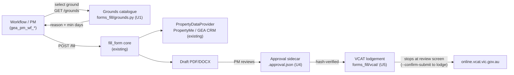

# feat: Renter notices (grounds catalogue, breach/general specs) + PM approval and VCAT lodgement

**Target dir:** `forms_fill/` (headless CLI/API; consumed by gea_pm_wf_rentreview and future PM workflows)

---

## Summary

Extend forms_fill to cover the full set of RTA 1997 (Vic) renter notices a
Residential Rental Provider issues: a machine-readable statutory grounds
catalogue (22 notice-to-vacate grounds across 4 notice tiers, 11 breach-of-duty
grounds, 5 general notice types), new form specs for Breach of Duty and General
notices following the shipped `notice_to_vacate` pattern, and a PM
approval-then-lodge pipeline: generated notices are drafts for PM review, and
on approval the system can lodge the follow-on application in VCAT's online
portal via browser automation.

Notice of Rent Increase 44(1) (`cav_rent_increase_notice`) and the Notice to
Vacate form (`notice_to_vacate`) are already shipped — this plan layers the
grounds catalogue onto them, it does not rebuild them.

---

## Problem Frame

PMs need to issue the standard CAV notices to renters with data fetched from
PropertyMe or GEA CRM rather than typed by hand, pick the correct statutory
ground (each ground fixes the minimum notice period), review the draft, and —
where the next step is a tribunal application — lodge it in VCAT online
instead of re-keying everything into the portal.

**Legal shape encoded in this plan:** notices are *served on the renter* (by
the PM, manually — the existing hard rule, unchanged). VCAT lodgement applies
to the *follow-on application* (e.g. a possession application after a notice
to vacate, or a compensation/compliance application after a breach notice).
Lodgement fires only after explicit PM approval — never automatically from
generation.

---

## Requirements

- **R1** — Statutory grounds catalogue: every ground the user listed is
  represented with section number (e.g. `91ZM`), human description
  (e.g. "Non-payment of rent"), notice family (vacate / breach_of_duty /
  general / rent_increase), and minimum notice period tier (immediate / 14 /
  28 / 90 days for vacate grounds; the breach-of-duty and general families use
  their statutory fixed periods). Queryable via CLI and a `GET /grounds`
  API endpoint so workflows and PMs can select a ground programmatically.
- **R2** — `breach_of_duty_notice` form spec: CAV "Notice for breach of duty
  to renter/s of rented premises" template, ground selected from the R1
  catalogue, premises/renter/provider data fetched from the configured
  provider, caller supplies the breach particulars and required-remedy text
  verbatim.
- **R3** — General notices ("Giving Notice to Renter" — 55(1) utility
  charges, 78(1) damage, 79(1)/(2) cost of repairs, 86 notice of entry):
  one or more form specs sized by what the real CAV templates turn out to be
  (single shared template vs separate documents — resolved at implementation
  when the templates are downloaded, same as `notice_to_vacate` did).
- **R4** — Data fetch parity: all new specs resolve premises, renters, and
  rental provider (owner) via the existing `PropertyDataProvider` interface —
  PropertyMe and GEA CRM both work with no per-form provider code.
- **R5** — Approval state: a generated notice is a draft. A lightweight
  approval record (who approved, when, which draft file hash) must exist
  before lodgement is possible. No approval → lodgement refuses.
- **R6** — VCAT online lodgement: on an approved notice whose ground maps to
  a VCAT application type, a lodgement step drives the VCAT online portal
  (`online.vcat.vic.gov.au`) via browser automation, authenticating with
  credentials from environment variables (never the repo), fills the
  application from the same TenancyBundle + notice data, and stops at the
  final review screen for PM confirmation by default (a `--confirm-submit`
  flag/parameter performs the actual submission).
- **R7** — Credentials hygiene: VCAT credentials are provided via env vars /
  deployment secrets. The credentials pasted in chat must be rotated and are
  never written to the repo, logs, or result JSON.

**Out of scope:** Slate wizard UI for these notices (forms_fill only, per
scoping); automating *service* of notices on renters (always manual, existing
hard rule); VCAT application types unrelated to these notices; rebuilding the
two shipped forms.

### Deferred to Follow-Up Work
- Slate UI surface for browsing the grounds catalogue.
- Additional VCAT application types beyond the possession/compliance flows
  these notices lead to.

---

## Key Technical Decisions

**KTD1 — One form spec per notice *family*, ground as data.** The 22 vacate
grounds share one CAV form; the ground contributes `reason_for_notice` +
`minimum_notice_days` values. The shipped `notice_to_vacate` spec already
takes both as caller fields, so the catalogue (U1) slots in front of it with
zero spec changes. Breach and general families follow the same shape.

**KTD2 — Catalogue is data, not code.** A single module
(`forms_fill/grounds.py`) holding a tuple of frozen dataclass entries, plus
registry-style lookup helpers. No database — the statute changes rarely, and
the file is the reviewable source of truth with the Act citation per entry.

**KTD3 — Real CAV templates, inspected before spec-writing.** Same discipline
as `notice_to_vacate`: download the current CAV DOCX for each new form,
derive table/cell indices with python-docx, record the source URL and download
date in the spec docstring. No guessed indices.

**KTD4 — Approval is a small JSON sidecar, not a workflow engine.** Approval
writes `<output>.approval.json` (approver, ISO timestamp, SHA-256 of the
approved PDF/DOCX). Lodgement verifies the hash matches the file it is about
to lodge — a re-generated (changed) notice invalidates the approval. No
database, no queue; the calling workflow owns orchestration.

**KTD5 — VCAT lodgement via Playwright script, review-gated.** A dedicated
`forms_fill/vcat/` module using Playwright (already a dependency in the
adjacent Slate project; added to forms_fill's own deps) drives the portal.
Default behavior stops at VCAT's final review screen and screenshots it for
the PM; actual submission requires the explicit confirm flag (R6). Selectors
live in one place with a smoke script, because the portal will change under
us. AI-driven automation (Skyvern/Stagehand/browser-use) is deliberately not
used for lodgement — a deterministic script is auditable and repeatable for a
legal filing; revisit only if the portal proves too dynamic.

**KTD6 — Credentials via env (`VCAT_USERNAME` / `VCAT_PASSWORD`).** Loaded at
lodgement time, never logged, never echoed into result JSON, redacted from
errors. R7.

---

## High-Level Technical Design

---

### U1. Statutory grounds catalogue

**Goal:** Machine-readable catalogue of all grounds/notice types from the
request, queryable via CLI and API.

**Requirements:** R1, KTD1, KTD2

**Dependencies:** none

**Files:**
- `forms_fill/forms_fill/grounds.py` (new)
- `forms_fill/forms_fill/api.py` (edit — add `GET /grounds`, optional
  `?family=` filter)
- `forms_fill/forms_fill/cli.py` (edit — add `forms grounds` subcommand)
- `forms_fill/tests/test_grounds.py` (new)

**Approach:** Frozen dataclass `Ground(section, description, family,
min_notice_days, form_key)` where `min_notice_days` is `0` for
immediate/today notices and `None` where no fixed period applies (general
notices). `form_key` links each ground to the registry form that renders it
(`notice_to_vacate`, `breach_of_duty_notice`, etc.). Entries transcribed
exactly from the user's list — 22 vacate (grouped immediate/14/28/90), 11
breach, 5 general, 1 rent increase (44(1), maps to the shipped
`cav_rent_increase_notice`).

**Patterns to follow:** `forms_fill/forms_fill/registry.py` (stable-key
lookup + clear unknown-key error).

**Test scenarios:**
- Happy path: lookup `91ZM` returns family `vacate`, 14 days,
  `notice_to_vacate` form key; `60(1)` returns breach family.
- Counts: exactly 22 vacate grounds, 11 breach, 5 general, 1 rent-increase
  (guards against transcription drift).
- Edge: unknown section raises the same error shape as `UnknownFormError`.
- API: `GET /grounds?family=vacate` returns only vacate entries; unknown
  family → 400 with clear message.
- CLI: `forms grounds --family breach_of_duty` prints the 11 entries.

**Verification:** tests pass; every section number in the user's request
appears exactly once in the catalogue.

---

### U2. Breach of Duty notice form spec

**Goal:** `breach_of_duty_notice` renders the CAV "Notice for breach of duty
to renter/s of rented premises" from fetched data + caller particulars.

**Requirements:** R2, R4, KTD1, KTD3

**Dependencies:** U1 (ground supplies description/section rendered on the form)

**Files:**
- `forms_fill/forms_fill/forms/breach_of_duty_notice/spec.py` (new)
- `forms_fill/forms_fill/forms/breach_of_duty_notice/template.docx` (new —
  downloaded from CAV, source URL + date in docstring)
- `forms_fill/forms_fill/registry.py` (edit — register)
- `forms_fill/tests/test_breach_spec.py` (new)

**Approach:** Mirror `notice_to_vacate/spec.py` exactly: provider-fetched
premises/renter/provider fields; caller fields for the ground section +
description (from U1), breach particulars (free text), required remedy, and
any compensation amount. Delivery/signature sections left blank by design
(same rule as the shipped specs). Table indices derived from the real
template with python-docx before writing ops.

**Execution note:** Download and inspect the actual CAV template first — the
spec cannot be written from memory of the form.

**Patterns to follow:** `forms_fill/forms_fill/forms/notice_to_vacate/spec.py`
(structure, docstring discipline, blank-by-design list),
`forms_fill/tests/test_ntv_spec.py` (test shape).

**Test scenarios:**
- Happy path: fill with fixture tenancy + a 60(1) ground → ok:true, expected
  filled_fields count, ground description appears in output DOCX.
- Blank fields: missing renter3/4 reported in `blank_fields`, not errors.
- Error path: unknown ground section → clear error before any render.
- Integration: full CLI fill against the fixture provider produces a DOCX.

**Verification:** spec tests pass; manual open of the filled DOCX shows
values in the correct cells.

---

### U3. General notices form spec(s)

**Goal:** Cover 55(1), 78(1), 79(1), 79(2), 86 ("Giving Notice to Renter").

**Requirements:** R3, R4, KTD1, KTD3

**Dependencies:** U1

**Files:**
- `forms_fill/forms_fill/forms/general_notice/…` (new — exact module count
  resolved when templates are downloaded; 1 spec if CAV publishes one shared
  form, up to 5 if separate)
- `forms_fill/forms_fill/registry.py` (edit — register)
- `forms_fill/tests/test_general_spec.py` (new)

**Approach:** Same as U2. Implementation-time discovery: fetch the actual CAV
document(s) for these notice types first; size the module accordingly and
record the decision in the spec docstring. Notice of entry (86) needs an
entry date/time/reason caller field; utility charges (55(1)) needs
amount/utility fields — each general ground declares its extra caller fields
in the catalogue entry so the spec can validate them.

**Test scenarios:** same shape as U2 per template — happy path per ground
type, blank-field reporting, unknown-ground error, one CLI integration fill.

**Verification:** as U2.

---

### U4. Approval record

**Goal:** PM approval gate between generation and lodgement (R5, KTD4).

**Requirements:** R5, KTD4

**Dependencies:** none (parallel to U2/U3)

**Files:**
- `forms_fill/forms_fill/approval.py` (new)
- `forms_fill/forms_fill/api.py` (edit — `POST /approve` with output file
  reference + approver name)
- `forms_fill/forms_fill/cli.py` (edit — `forms approve <file> --by <name>`)
- `forms_fill/tests/test_approval.py` (new)

**Approach:** `approve(path, approver)` writes `<path>.approval.json`
(approver, UTC timestamp, sha256 of file). `verify_approval(path)` returns
the record iff the hash still matches. No state elsewhere.

**Test scenarios:**
- Happy path: approve then verify → record returned.
- Tamper: regenerate/modify the file after approval → verify fails with a
  clear "notice changed since approval" error.
- Missing: verify without approval → distinct "not approved" error.
- API: `POST /approve` on a known request_id's output; 404 on unknown.

**Verification:** tests pass; approval JSON contains no tenant PII beyond
the file reference.

---

### U5. VCAT online lodgement

**Goal:** Drive online.vcat.vic.gov.au to lodge the follow-on application
from an approved notice, stopping at the review screen unless explicitly
confirmed (R6, KTD5, KTD6).

**Requirements:** R6, R7, KTD5, KTD6

**Dependencies:** U4 (approval gate), U1 (ground → application-type mapping)

**Files:**
- `forms_fill/forms_fill/vcat/__init__.py`, `forms_fill/forms_fill/vcat/lodge.py`,
  `forms_fill/forms_fill/vcat/selectors.py` (new)
- `forms_fill/forms_fill/cli.py` (edit — `forms vcat-lodge <approved-file>
  [--confirm-submit]`)
- `forms_fill/pyproject.toml` (edit — add `playwright`)
- `forms_fill/tests/test_vcat_lodge.py` (new — unit-level: gate logic,
  redaction, mapping; portal driving itself is smoke-tested manually)

**Approach:** `lodge(approved_path, confirm=False)`: verify approval (U4),
map the notice's ground to a VCAT application type (mapping table lives with
the catalogue; grounds with no VCAT follow-on refuse with a clear message),
launch Playwright, log in with `VCAT_USERNAME`/`VCAT_PASSWORD` env vars, fill
the application from the notice's request data, screenshot the review screen
to the output dir, and stop there unless `confirm=True` submits and captures
the lodgement reference number into result JSON. All exceptions redact
credentials. Selector drift is expected: keep every selector in
`selectors.py` with a comment naming the screen, and fail with "portal layout
changed" guidance rather than a raw Playwright error.

**Execution note:** The portal flow must be walked manually once (with the
user's credentials supplied via env at runtime) to record the real screens
and selectors before writing `lodge.py` — do not code the flow blind.
Smoke-verify end-to-end up to (not through) the final submit.

**Test scenarios:**
- Gate: unapproved file → refuses before any browser launch.
- Gate: approved-then-modified file → refuses (hash mismatch, via U4).
- Mapping: ground with no VCAT application type → clear refusal naming the
  ground.
- Redaction: forced login failure produces an error containing neither env
  var value.
- Default-stop: `confirm=False` never reaches the submit action (assert via
  the flow's step list / mock page).
- Integration (manual, documented in README): full run to review screen with
  screenshot produced.

**Verification:** unit tests pass; one manual smoke run reaches the VCAT
review screen and produces the screenshot; no credential text appears in any
output artifact.

---

## Risks & Dependencies

- **Portal fragility (U5):** VCAT can change layout/flow at any time;
  selectors will rot. Mitigated by centralised selectors, screen-named
  failures, and the review-screen stop default — a broken flow can't submit
  garbage. Accepted residual: lodgement is best-effort automation with a
  manual fallback (PM lodges by hand).
- **VCAT terms of use / auth:** automated portal use is on the user's own
  account and behalf. The confirm-gate keeps a human decision on every actual
  submission. If the portal offers a supported API or bulk channel, prefer it
  when discovered.
- **Template availability (U2/U3):** CAV may distribute some general notices
  as PDF-only or not at all; if a template can't be sourced, that ground's
  form work pauses and the catalogue entry marks it `form_key=None` (catalogue
  still complete).
- **Credentials exposure:** the VCAT password was pasted into chat and should
  be rotated before U5 is used in anger (R7).

---

## Definition of Done

- Catalogue contains every section from the request exactly once, with
  correct family and notice-period tier; `GET /grounds` and `forms grounds`
  both serve it.
- `breach_of_duty_notice` and the general notice spec(s) registered and
  filling from both fixture data and a live provider (PropertyMe or GEA CRM)
  without per-form provider code.
- Approval sidecar gates lodgement; tampered/unapproved files refuse.
- VCAT lodgement reaches the portal review screen headlessly with env-var
  credentials, screenshots it, and submits only with the explicit confirm
  flag; credentials never appear in repo, logs, or outputs.
- All new units carry passing tests (`pytest` in `forms_fill/`); existing
  54+ tests still pass.
- VCAT password rotated (user action — flagged, not automatable).
