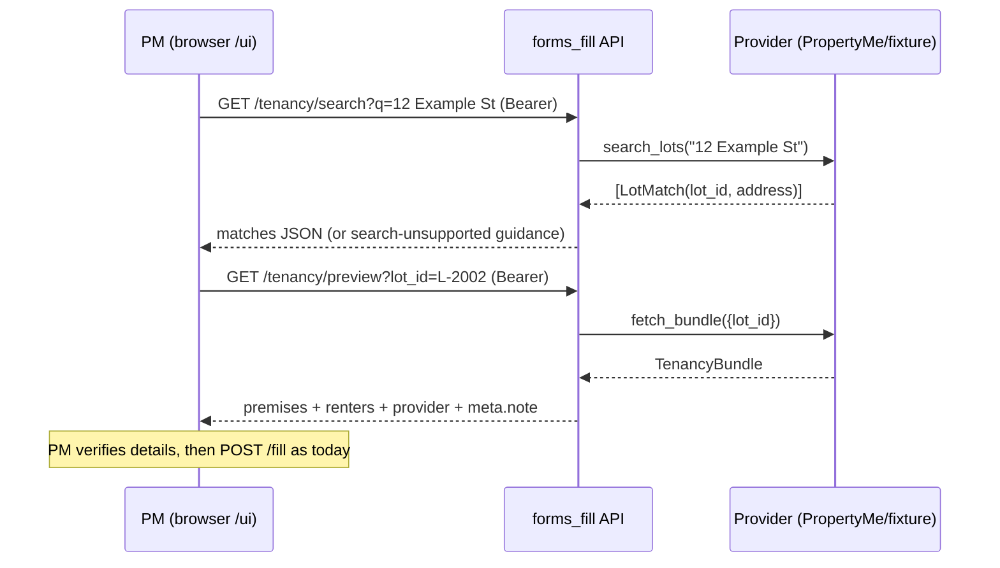

# feat: /ui layout fixes + address search with tenancy preview

**Target dir:** `forms_fill/`

---

## Summary

Two improvements to the PM-facing `/ui` page: fix the visual defects visible in
the current build (mangled native `<select>` rendering, inconsistent overlay/
spacing), and replace blind Lot-ID entry with an address-search flow — the PM
types a street address, picks the matching property, and the resolved tenancy
bundle (premises, renters, rental provider) is displayed for verification
before the form is generated. ID entry remains as a fallback for providers
without search.

---

## Requirements

- **R1 — Layout/overlay fixes:** `<select>` elements render with the browser
  default chrome fighting the custom theme (double-arrow spinner overlapping
  the border inset, squashed option text). Style selects consistently with the
  text inputs (custom appearance, own chevron), and audit the page for other
  overlay/spacing defects (fieldset legend overlap, token banner, result box).
- **R2 — Address search:** a search box in the Tenancy section; typing an
  address and searching lists matching properties from the selected data
  source. Selecting a match populates the lot/tenancy identifiers.
- **R3 — Tenancy preview:** after selection (or on explicit fetch when using
  raw IDs), the UI shows the resolved bundle — premises address, renter names,
  rental provider name — so the PM verifies the right tenancy before filling.
  Any provider `meta.note` (data-quality flag) is displayed prominently.
- **R4 — Provider capability honesty:** PropertyMe implements real search;
  fixture matches its sample tenancy (so the flow is demo-able); GEA CRM
  returns a clear "search not supported — enter Lot/Tenancy ID" and the UI
  degrades to the existing ID fields without erroring.
- **R5 — Auth unchanged:** new endpoints sit behind the same bearer-token
  guard as every other API route.

**Out of scope:** changing the fill pipeline or form specs; PM approval/VCAT
flows; any provider write operations; GEA CRM server-side search (would need a
new CRM endpoint — deferred).

### Deferred to Follow-Up Work
- GEA CRM address search (needs a new endpoint in the CRM repo).
- Debounced type-ahead; a plain search button is enough for v1.

---

## Key Technical Decisions

**KTD1 — Search is a provider capability with a default "unsupported".**
`PropertyDataProvider` gains `search_lots(query) -> list[LotMatch]` with a
base implementation that raises a typed `SearchUnsupportedError`. Providers
opt in; the API translates the error into a structured 501-style response the
UI can render as guidance, not a failure.

**KTD2 — Two new read-only endpoints, same auth.**
`GET /tenancy/search?q=<address>&provider=<name>` → list of matches
(lot_id, address label). `GET /tenancy/preview?lot_id=..&tenancy_id=..&provider=..`
→ the `TenancyBundle` serialised for display. Preview reuses `fetch_bundle`
verbatim — no new provider code for it.

**KTD3 — PropertyMe search implemented against the live API surface.**
The exact lots-list/search endpoint (`/v1/lots` with a search param, or list +
client-side filter) is confirmed against PropertyMe's Swagger
(`GET /api/openapi`) at implementation time — same discipline as the original
provider build (documented endpoints in the module docstring). Read-only GETs
only.

**KTD4 — Selects styled with `appearance: none` + inline SVG chevron.**
Native select chrome is the cause of the overlay defect in the screenshot;
removing it and drawing our own chevron matches the existing input styling
with no JS.

**KTD5 — No framework.** The page stays a single static HTML file with
vanilla JS, as built. The preview panel is a small DOM template, not a
component library.

---

## High-Level Technical Design

---

### U1. Provider search capability

**Goal:** `search_lots` on the provider interface; PropertyMe + fixture
implementations; typed unsupported error for GEA CRM.

**Requirements:** R2, R4, KTD1, KTD3

**Dependencies:** none

**Files:**
- `forms_fill/forms_fill/providers/base.py` (edit — add `LotMatch` dataclass or
  pydantic model, `search_lots` default raising `SearchUnsupportedError`)
- `forms_fill/forms_fill/errors.py` (edit — add `SearchUnsupportedError`)
- `forms_fill/forms_fill/providers/propertyme.py` (edit — implement against the
  confirmed lots endpoint; document endpoint + date in docstring)
- `forms_fill/forms_fill/providers/fixture.py` (edit — case-insensitive
  substring match against the sample tenancy's address)
- `forms_fill/tests/test_provider_search.py` (new)

**Approach:** `LotMatch` carries `lot_id`, `address_label`, and optional
`tenancy_id`. PropertyMe: query the lots resource, filter/map to matches,
cap at ~10 results. GEA CRM inherits the base unsupported error.

**Execution note:** Confirm the PropertyMe lots/search endpoint shape against
its Swagger before coding; do not guess parameter names.

**Test scenarios:**
- Fixture: searching "example" returns the sample lot (L-2002) with its
  address label; searching "zzz" returns [].
- Base/GEA CRM: `search_lots` raises `SearchUnsupportedError`.
- PropertyMe: mapping test on a canned lots-response fixture (no live call) —
  correct lot_id/address extraction, result cap enforced.
- Edge: empty/whitespace query raises a clear validation error before any
  provider call.

**Verification:** tests pass; fixture search works via the CLI/API end-to-end.

---

### U2. Search + preview API endpoints

**Goal:** `GET /tenancy/search` and `GET /tenancy/preview`, bearer-guarded.

**Requirements:** R2, R3, R4, R5, KTD2

**Dependencies:** U1

**Files:**
- `forms_fill/forms_fill/api.py` (edit)
- `forms_fill/tests/test_api.py` (edit — new endpoint tests)

**Approach:** Both endpoints accept `provider=` override mirroring `POST /fill`.
Search returns `{matches: [...]}`; unsupported search returns a 400-family
response with `{error: "search_unsupported", message: ...}` the UI can show
verbatim. Preview returns the bundle plus `meta.note` passthrough; unknown
lot/tenancy surfaces the provider's `TenancyNotFoundError` as 404.

**Patterns to follow:** existing `GET /grounds` and `POST /fill` handlers
(auth dependency, error translation).

**Test scenarios:**
- 401 without bearer token on both endpoints.
- Fixture search happy path; empty `q` → 422/400 with message.
- Search on gea_crm → structured search_unsupported response, not a 500.
- Preview happy path returns premises/renters/provider fields; unknown lot →
  404.

**Verification:** API tests pass; manual curl of both endpoints.

---

### U3. UI: layout fixes + lookup flow

**Goal:** Fix R1 visual defects and wire the search → pick → preview → fill
flow into `/ui`.

**Requirements:** R1, R2, R3, R4, KTD4, KTD5

**Dependencies:** U2

**Files:**
- `forms_fill/forms_fill/static/index.html` (edit)
- `forms_fill/tests/test_ui_routes.py` (edit — static-content assertions only
  where cheap)

**Approach:**
- Selects: `appearance: none` (+ vendor prefixes), padding-right for a
  background-image SVG chevron, same border/radius/min-height as inputs.
- Audit and fix: legend/fieldset overlap, token banner spacing, result box,
  focus states; keep the existing theme variables.
- Tenancy section becomes: address search input + button → results list →
  picking a result stores lot/tenancy IDs and calls preview → preview card
  showing premises, renters, rental provider, and any `meta.note` warning.
  A "enter IDs manually" toggle reveals the existing Lot/Tenancy ID inputs
  (default view when the provider reports search unsupported).
- Fill button disabled until either a preview has loaded or manual IDs are
  entered (soft guard only — API remains the enforcer of correctness).

**Execution note:** This is styling + a small flow; verify in a real browser
at desktop and mobile widths (server is already running locally) rather than
relying on route tests.

**Test scenarios:**
- Route test: `/ui/` still 200 and contains the search input id.
- Manual browser check (documented in the PR/commit): selects render cleanly
  in light/dark, search→preview→fill round-trip works on fixture, gea_crm
  path shows the unsupported guidance and manual ID fields.

**Verification:** browser walkthrough on the running local server; a fixture
fill completes end-to-end from an address search.

---

## Risks & Dependencies

- **PropertyMe search surface unknown until Swagger check (U1):** if lots
  aren't searchable server-side, fall back to listing + client-side filter
  with a result cap; if the account has very many lots this may be slow —
  acceptable for v1, noted in the module docstring.
- **UI is untested by automation:** the flow is verified manually; route tests
  only assert the page serves. Accepted — consistent with the existing UI's
  test posture.

---

## Definition of Done

- Selects and page layout render cleanly (no native chrome overlay artefacts)
  in light and dark themes.
- Address search on the fixture provider finds the sample tenancy; picking it
  shows premises/renters/owner; fill completes from there without typing IDs.
- GEA CRM search shows clear guidance and manual ID entry still works.
- PropertyMe `search_lots` implemented against its confirmed API and covered
  by a mapping test on canned data.
- Both new endpoints reject unauthenticated requests.
- Full `pytest` suite passes.
