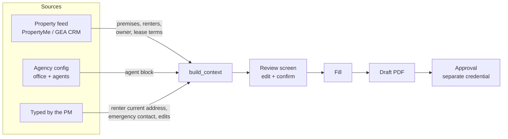
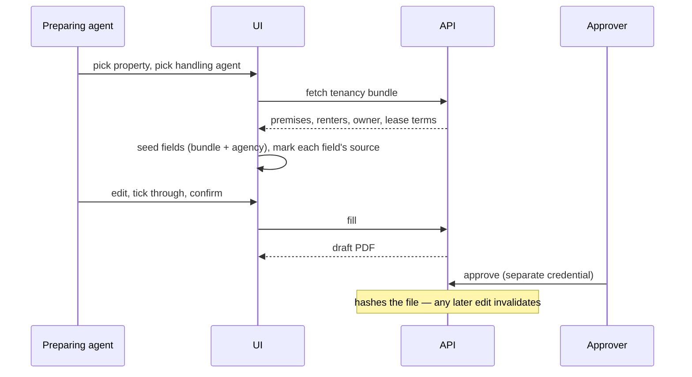
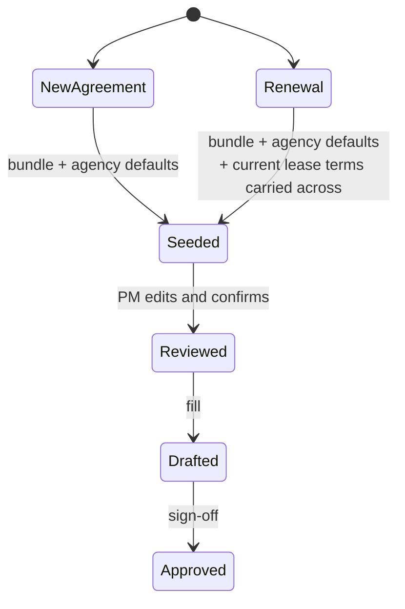

# feat: Auto-populate the rental agreement and add a prepare → review → approve flow

## Goal Capsule

Filling a residential rental agreement today means typing roughly thirty fields by hand into one flat run of text boxes, even though the agency already holds most of the answers. This plan pulls those answers through — lease term, rent, bond and payment dates from the property feed; the agent block from GEA's own stored details — adds a renewal mode that seeds a new agreement from the tenancy's current lease, and puts a review-and-approve step in front of the PM so nothing reaches a renter unchecked.

Covers both agreement forms (Form 1 and the 5-year+ Form 2), both data providers, and the shared form UI.

---

## Problem Frame

`residential_rental_agreement` declares 49 fields. Only 19 are fetched from the tenancy bundle (premises, rental provider, renter names/phones/emails); the other 30 are caller-supplied and typed by hand every time. Three distinct causes:

1. **The provider contract stops short of the lease.** `TenancyBundle` carries premises, renters, owner, and current rent/period — but not lease dates, bond, or payment schedule. The agreement needs all of them, so they are typed.
2. **The agency's own details are unreachable from this form.** GEA Berwick's office and agent details exist in the agency config, but only sales forms read them. The agreement's agent block (name, address, postcode, phone, email) is retyped despite being a constant.
3. **The UI renders every caller field identically.** Each is a bare text input, in declaration order, under one legend — no date pickers on the eight date fields, no dropdowns on the term-type and rent-period fields (even though the catalogue already publishes their allowed values), and no grouping matching the form's own numbered sections.

Separately, there is no checkpoint. A PM fills, submits, and gets a PDF. An approval mechanism exists in the API — it records the approver, hashes the file so any later edit invalidates the record, and deliberately uses a different secret from the generation token — but nothing in the UI reaches it, and it acts on the finished file rather than on the data going in.

---

## Requirements

| ID | Requirement |
|---|---|
| R1 | The tenancy bundle carries the lease terms the agreement needs: term type and dates, rent amount/period/payment day/first payment due, bond amount and due date. |
| R2 | PropertyMe supplies those lease terms from its tenancy record. |
| R3 | The GEA CRM adapter consumes those lease terms when present, and the published data contract states what the CRM must return. (The CRM-side change itself is deferred — see Scope Boundaries.) |
| R4 | A provider that omits the new lease data still works — the fields come back blank, not as an error. |
| R5 | The agent block auto-fills from GEA's stored details: the Berwick office is fixed, the handling agent is chosen at fill time from a list. |
| R6 | Both agreement forms (Form 1 and Form 2) auto-fill identically where their sections are identical. |
| R7 | Anything auto-filled remains editable, and an edited value always wins over the fetched one. |
| R8 | A renewal mode seeds the new agreement from the tenancy's current lease terms. |
| R9 | Date fields render as date pickers; fields with a fixed set of allowed values render as dropdowns. |
| R10 | Caller fields are grouped under the agreement's own numbered sections rather than one flat list. |
| R11 | Before generating, the preparing agent sees every field with where its value came from, can edit any of them, and confirms the set. |
| R12 | After generating, the agreement can be signed off through the existing approval step, from the UI. |
| R13 | The renter's current (pre-tenancy) address stays manual — no source holds it. |
| R14 | Negotiated tick sections (payment method, electronic-service consent), owners corporation, condition report, additional terms and signature blocks stay blank by design. |

---

## Key Technical Decisions

**KTD1 — Lease data joins the existing bundle contract rather than arriving as a parallel structure.** `TenancyBundle` is already the one shape every provider returns and every form's `build_context` consumes. A second fetch path for lease data would need its own provider method, its own error handling, and its own caching story. New optional fields on the existing bundle inherit all of that. The models reject unknown keys, so the addition must be a new nested block with defaults — a provider that omits it validates fine (R4).

**KTD2 — Agency defaults become provider-agnostic, not sales-specific.** The agency loader currently lives in the sales-form module and returns sales-shaped keys (`agent_name` meaning the agency's trading name, `attention` meaning the person). The agreement needs the opposite reading: `agent_name` is the managing agent's own name. Rather than reinterpreting sales keys, lift agency loading into a shared module that exposes the raw office and agent records, and let each form map them to its own field names. Sales keeps its current output shape unchanged.

**KTD3 — The handling agent is a list in the agency config, selected per fill.** GEA Berwick has one office but multiple agents; the current config holds exactly one agent as a flat record. Extending it to a list with the existing entry as the default preserves every current sales-form caller while giving the agreement a picker (R5).

**KTD4 — Auto-filled values are defaults, never overrides.** The core's existing rule is that caller fields render verbatim. Auto-fill must not invert that: `build_context` fills a field from the bundle or agency config only when the caller supplied nothing for it. This keeps the tool's "no computed values, no statutory logic" posture intact and satisfies R7.

**KTD5 — Renewal seeds from the tenancy's current lease, not from a stored fill history.** *(session-settled: user-directed — chosen over a fill-history store: the tenancy the PM is renewing is by definition the previous lease, so the data is already in the bundle and no new persistence is needed.)* A renewal is a new agreement for a tenancy that already has one; the active tenancy record holds the terms being carried across. This makes R8 a mode flag over data already fetched rather than a new storage concern.

**KTD6 — Review happens before generation; approval stays after it.** Approval hashes the generated file so that editing it invalidates the record — that property is the point of the mechanism and must not be softened. So the tick-and-edit pass sits between fetching data and filling (R11), and the existing approval step signs off the resulting PDF (R12). Approval keeps its separate credential.

**KTD7 — Field presentation metadata belongs on the form spec, not in UI branching.** The UI already receives per-field `kind` and `options` from the catalogue but ignores them. Rather than hard-coding "these eight names are dates" in the page, extend the spec's field metadata with kind and section, and let the renderer read it. This fixes R9/R10 for all nineteen forms at once instead of special-casing the agreement.

---

## High-Level Technical Design

Where each field's value comes from once this lands:

The prepare → approve sequence, and why the order matters:

Renewal is a seeding mode over the same path, not a separate flow:

---

## Implementation Units

### U1. Add lease terms to the tenancy bundle

**Goal:** `TenancyBundle` can carry the lease facts the agreement needs, without breaking providers that don't supply them.

**Requirements:** R1, R4

**Dependencies:** none

**Files:**
- `forms_fill/forms_fill/models.py`
- `forms_fill/tests/test_models.py`

**Approach:**
1. Add a nested lease block to `TenancyBundle` with a default factory, so an omitting provider still validates against the strict model.
2. Cover term type and dates, rent amount/period/payment day/first payment due, and bond amount and due date. Keep money and dates string-typed, matching how `current_rent` is already handled — this tool does not parse or compute either.
3. Leave the existing top-level `current_rent` / `rent_period` in place; they are consumed by the rent-increase notice and are not this unit's business.

**Patterns to follow:** the existing `Premises` / `RentalProvider` nested models and their all-defaults construction.

**Test scenarios:**
- A bundle payload with no lease block validates, and the lease fields read as empty strings.
- A bundle payload with a full lease block round-trips every field.
- A bundle payload with a partial lease block validates, with the absent fields empty.
- An unknown key inside the lease block is rejected, matching the strict-model behaviour of the sibling blocks.

**Verification:** existing model and provider tests pass untouched; a bundle built the old way is still valid.

---

### U2. Map lease terms in the PropertyMe adapter

**Goal:** PropertyMe tenancies return their lease terms in the new bundle block.

**Requirements:** R2, R4

**Dependencies:** U1

**Files:**
- `forms_fill/forms_fill/providers/propertyme.py`
- `forms_fill/tests/test_providers.py`

**Approach:**
1. Extend the existing tenancy-record mapping — the same record that already yields rent amount and period — to populate the lease block.
2. Reuse the adapter's existing money and string coercion helpers rather than adding new ones.
3. Where the tenancy record has no corresponding value, leave the field blank rather than deriving one.

**Execution note:** the exact PropertyMe field names for lease end, bond amount and payment schedule are not confirmed from the code alone — only tenancy start is visibly used today. Confirm them against a live tenancy record or the API reference before mapping, and leave unmapped anything that cannot be confirmed rather than guessing a name.

**Patterns to follow:** the current rent/period mapping in the adapter's bundle assembly.

**Test scenarios:**
- A tenancy fixture carrying full lease data produces a bundle with each lease field populated.
- A tenancy fixture missing the lease fields produces a bundle whose lease block is empty, with no exception.
- Money-shaped values pass through the same formatting as the existing rent amount.
- The multiple-active-tenancy path still attaches its data-quality note and still selects the most recent.

**Verification:** provider tests pass; a bundle fetched for a fixture tenancy shows lease values in the preview response.

---

### U3. Map lease terms in the GEA CRM adapter and publish the contract change

**Goal:** GEA CRM supplies the same lease terms, and the CRM team has a written spec for what to return.

**Requirements:** R3, R4

**Dependencies:** U1

**Files:**
- `forms_fill/forms_fill/providers/gea_crm.py`
- `docs/integrations/crm-data-contract-prompt.md`
- `forms_fill/tests/test_gea_crm.py`

**Approach:**
1. Map the new lease block from the CRM response, following the adapter's existing 1:1 mapping style.
2. Treat the lease keys as optional in the adapter's contract validation — the CRM will not return them until its own change ships, and forms-fill must keep working in the meantime (R4).
3. Update the published data contract to describe the lease block, its keys, and the null-not-omitted convention the rest of the document already establishes.

**Execution note:** the CRM-side change lands in a different repository. This unit is complete when the adapter handles both shapes and the contract document specifies the new block — not when the CRM returns it.

**Patterns to follow:** the adapter's existing required-keys validation and its blanks-are-expected posture.

**Test scenarios:**
- A CRM response with the lease block maps every field through.
- A CRM response without the lease block still produces a valid bundle, and contract validation does not fail.
- A CRM response with the lease block present but individually null yields empty strings, not nulls.
- The existing data-quality note path is unaffected.

**Verification:** CRM adapter tests pass against both response shapes; the contract document describes the block.

---

### U4. Make agency and agent details available to any form, with a selectable handling agent

**Goal:** GEA's office details and a chosen handling agent are reachable from non-sales forms.

**Requirements:** R5

**Dependencies:** none

**Files:**
- `forms_fill/forms_fill/agency.py` (new)
- `forms_fill/forms_fill/sales.py`
- `forms_fill/fixtures/gea_agency.json`
- `forms_fill/forms_fill/api.py`
- `forms_fill/tests/test_agency.py` (new)
- `forms_fill/tests/test_api.py`

**Approach:**
1. Lift agency-config loading out of the sales module into a shared module that returns the office record and the list of agents as-is, per KTD2.
2. Extend the agency fixture so agents are a list, keeping the current entry as the default; preserve the existing single-agent key for backward compatibility if that is cheaper than migrating callers.
3. Reduce the sales module to a thin mapping over the shared loader so its current output keys are unchanged.
4. Expose the office and the agent list through the API so the UI can offer a picker.

**Patterns to follow:** the current agency-file loading, including its environment-variable override and its missing-file error.

**Test scenarios:**
- The shared loader returns the office record and every configured agent.
- Sales-form context is byte-identical to its current output for the same inputs.
- A config file with a single legacy agent record still loads, yielding a one-agent list.
- A missing config file raises the same configuration error as today.
- The agent-list endpoint requires the bearer token and returns the configured agents.

**Verification:** sales-form tests pass unchanged; the new endpoint lists the Berwick agents.

---

### U5. Auto-fill the agreement's agent block and lease fields

**Goal:** Form 1 and Form 2 fill their agent block from the agency config and their lease fields from the bundle, with caller values still winning.

**Requirements:** R5, R6, R7, R13, R14

**Dependencies:** U1, U4

**Files:**
- `forms_fill/forms_fill/forms/residential_rental_agreement/spec.py`
- `forms_fill/forms_fill/forms/residential_rental_agreement_5yr/spec.py`
- `forms_fill/tests/test_rental_agreement.py`

**Approach:**
1. In each form's context builder, seed the agent block from the selected agent and the office record, and the term/rent/bond fields from the bundle's lease block.
2. Apply seeding only where the caller supplied nothing for that field, per KTD4.
3. Keep both forms' behaviour aligned for the sections they share; Form 2 has no periodic term option, so its term seeding is fixed-term only.
4. Leave the renter current-address fields, emergency contact, and every blank-by-design section untouched (R13, R14).

**Test scenarios:**
- A bundle with lease data and no caller fields fills term dates, rent, and bond from the bundle.
- A caller-supplied rent amount overrides the bundle's rent amount.
- A caller-supplied agent name overrides the configured agent's name.
- The agent block fills from the selected agent when no agent fields are supplied.
- A bundle with an empty lease block leaves those fields blank and reports them as blank fields, as today.
- Renter current-address fields stay blank when not supplied, even when the premises address is known.
- Form 2 produces the same agent block and rent/bond values as Form 1 for the same inputs.
- Form 2 does not tick a periodic term for any input.
- Blank-field accounting still lists the negotiated and signature sections.

**Verification:** rental-agreement tests pass; a fill against a fixture tenancy leaves markedly fewer blank fields than before.

---

### U6. Renewal mode

**Goal:** Preparing a renewal seeds the new agreement from the tenancy's current lease terms.

**Requirements:** R8, R7

**Dependencies:** U5

**Files:**
- `forms_fill/forms_fill/forms/residential_rental_agreement/spec.py`
- `forms_fill/forms_fill/forms/residential_rental_agreement_5yr/spec.py`
- `forms_fill/tests/test_rental_agreement.py`

**Approach:**
1. Add a caller-supplied renewal flag to both agreement specs.
2. When set, carry the current lease's rent, period, payment day, bond and term type across as defaults for the new agreement, per KTD5.
3. Do not carry across the dates that must change on a renewal — the new term's start and end, and the agreement date. Leaving these blank forces a deliberate entry rather than an inherited wrong date.
4. Caller precedence is unchanged: anything typed still wins.

**Execution note:** the risk here is a silently inherited stale figure. The review screen (U8) is what makes carried-across values visible; keep this unit's seeding conservative so nothing arrives pre-filled that should have been reconsidered.

**Test scenarios:**
- With the renewal flag set, rent, period, payment day, bond and term type carry across from the lease block.
- With the renewal flag set, the new term's start and end dates and the agreement date remain blank.
- With the flag unset, behaviour is identical to U5.
- A caller-supplied rent still overrides a carried-across rent.
- Renewal against a tenancy with an empty lease block behaves as a fresh agreement, with no error.
- Both forms behave identically for the shared fields.

**Verification:** rental-agreement tests pass; a renewal fill against a fixture tenancy carries rent and bond but not term dates.

---

### U7. Field presentation metadata and a grouped, typed form UI

**Goal:** Date fields get date pickers, fixed-value fields get dropdowns, and fields group under the form's own sections — for every form, not just the agreement.

**Requirements:** R9, R10

**Dependencies:** none

**Files:**
- `forms_fill/forms_fill/formspec.py`
- `forms_fill/forms_fill/registry.py`
- `forms_fill/forms_fill/forms/residential_rental_agreement/spec.py`
- `forms_fill/forms_fill/forms/residential_rental_agreement_5yr/spec.py`
- `forms_fill/forms_fill/static/index.html`
- `forms_fill/tests/test_forms_catalogue.py`
- `forms_fill/tests/test_ui_routes.py`

**Approach:**
1. Extend the spec's per-field metadata so a field can declare its input kind and the section it belongs to, per KTD7. Default to the current behaviour when a form declares neither, so the other seventeen forms are unaffected until they opt in.
2. Publish that metadata through the existing catalogue response, which already carries per-field kind and allowed values.
3. Rework the UI's caller-field renderer to read kind and section: date inputs for dates, selects populated from the published allowed values, textareas where they are already used, and one group per declared section.
4. Annotate both agreement specs with kinds and sections matching the printed form's numbering.

**Execution note:** this is shared UI touching every form. Verify a sales form and a notice still render correctly before considering the unit done — a regression here is wider than the agreement.

**Patterns to follow:** the existing catalogue construction and the current renderer's textarea heuristic, which this replaces with declared metadata.

**Test scenarios:**
- The catalogue publishes kind and section for a form that declares them.
- The catalogue falls back to current behaviour for a form that declares neither.
- A field with allowed values publishes them, as it does today.
- The agreement's date fields are published as dates and its term-type and rent-period fields as fixed-value selects.
- The rendered page groups agreement fields under the form's sections in order.
- A sales form and a notice still render every caller field.

**Verification:** catalogue and UI-route tests pass; the agreement page shows date pickers, dropdowns and section groups, and a notice page is unchanged.

---

### U8. Review screen before generating

**Goal:** The preparing agent sees every field with its source, edits what needs editing, and confirms before anything is generated.

**Requirements:** R11, R7

**Dependencies:** U5, U7

**Files:**
- `forms_fill/forms_fill/static/index.html`
- `forms_fill/tests/test_ui_routes.py`

**Approach:**
1. Insert a confirmation step between the seeded form and submission: list every field the fill will use, grouped as in U7, each showing its current value and where it came from — the property feed, the agency config, carried across from the current lease, or typed.
2. Make every listed value editable in place; an edit reclassifies the field as typed and wins over the seeded value (R7).
3. Show blank fields explicitly, so the agent sees what the printed form will leave empty rather than discovering it in the PDF.
4. Require an explicit confirmation before the fill request is sent.

**Execution note:** this is browser behaviour with no server contract change; prefer a runtime check against the running UI over unit coverage of the page internals.

**Patterns to follow:** the existing tenancy preview panel, which already renders fetched values for PM verification before a fill.

**Test scenarios:**
- The review step lists every field the fill will send, including those left blank.
- Each field shows a source, and a value seeded from the property feed is distinguishable from one that was typed.
- Editing a seeded value marks it as typed and the edited value is what gets sent.
- Submission is blocked until the confirmation is given.
- A renewal shows carried-across values as carried across, not as typed.
- A form with no fetched data (a sales form) still passes through the step coherently.

**Verification:** a fill driven through the UI sends exactly the values shown on the review screen; no path reaches the fill request without confirmation.

---

### U9. Approval in the UI

**Goal:** A generated agreement can be signed off through the existing approval step without leaving the browser.

**Requirements:** R12

**Dependencies:** U8

**Files:**
- `forms_fill/forms_fill/static/index.html`
- `forms_fill/forms_fill/api.py`
- `forms_fill/tests/test_approval.py`
- `forms_fill/tests/test_ui_routes.py`

**Approach:**
1. After a successful fill, offer sign-off on the generated file alongside the existing download links.
2. Collect the approver's name and the approval credential, which is deliberately separate from the generation token, per KTD6 — the UI must not reuse the stored generation token here.
3. Surface the approval outcome, including the case where approval is not configured on the server, which the API already reports distinctly.
4. Leave the statutory-ground binding unset for agreements; it is a notice concept and the existing record already treats it as optional.

**Execution note:** the two-credential split is a security property, not an inconvenience to design around. Do not add a path that lets the generating session approve its own output.

**Patterns to follow:** the existing approval endpoint and its separate-credential check; the UI's existing token handling, which this must not reuse for the approval secret.

**Test scenarios:**
- Approving a generated file records the approver and a hash of that file.
- Approval presented with the generation token rather than the approval credential is rejected.
- Approval attempted when the server has no approval credential configured reports that distinctly rather than failing opaquely.
- Re-generating the agreement after approval invalidates the earlier record, as the existing verification already enforces.
- An agreement approved without a statutory ground verifies successfully.
- The approval credential is not persisted alongside the generation token.

**Verification:** an agreement generated in the UI can be approved in the UI with the correct credential and cannot with the wrong one; existing approval tests pass.

---

## Scope Boundaries

**In scope:** both agreement forms, both providers, the shared form UI, the agency config, and the review-and-approve flow.

**Out of scope by design:**
- The renter's current pre-tenancy address stays manual (R13) — no system holds it.
- Payment-method and electronic-service-consent ticks, owners corporation, condition report, additional terms and signature blocks stay blank for completion on the printed form (R14).
- The tool still computes nothing: no derived dates, no notice periods, no statutory logic.

### Deferred to Follow-Up Work

- **The GEA CRM-side endpoint change.** U3 specifies it and makes forms-fill tolerant of its absence; implementing it belongs to the CRM repository.
- **Opting the other seventeen forms into the new field metadata.** U7 makes it available and leaves their current rendering intact; annotating each form is separate work.
- **A fill-history store.** Rejected for renewal (KTD5). Worth revisiting only if a renewal is ever needed for a tenancy whose prior terms are no longer the active ones.

---

## Risks & Dependencies

| Risk | Mitigation |
|---|---|
| PropertyMe's field names for lease end, bond and payment schedule are unconfirmed. | U2 confirms against a live record before mapping and leaves unconfirmed fields unmapped rather than guessing. |
| GEA CRM will not return lease data until its own change ships, so R3 is only half-satisfiable here. | U3's adapter treats the lease keys as optional; the contract document carries the spec to the CRM team. |
| A renewal silently inherits a stale rent or bond. | U6 seeds conservatively and refuses to carry term dates; U8 shows every carried-across value as such before generation. |
| The shared UI renderer serves all nineteen forms — a regression is wide. | U7 defaults to current behaviour for forms that declare no metadata, and its verification includes a sales form and a notice. |
| The two-credential approval split adds real friction to a single-agent office. | Treated as a property to preserve, not a problem to solve (KTD6). If it proves unworkable in practice, that is a product decision to revisit, not something to weaken in implementation. |

---

## Assumptions

- **Renewal seeds from the active tenancy's current lease** rather than a stored history of prior fills (KTD5). Recorded here because it was raised as an open fork and settled by default rather than by explicit choice; revisit if renewals are ever prepared against tenancies whose prior terms are no longer active.
- **The Berwick office is the only office** these agreements are prepared under; the agent list varies, the office does not (R5).

---

## Verification Contract

- The full test suite passes, including the sales-form and notice tests that U4 and U7 touch indirectly.
- A fill against a fixture tenancy leaves materially fewer blank fields than before this work.
- A renewal fill carries rent and bond across but leaves the new term's dates blank.
- The agreement page renders date pickers, dropdowns and section groups; a notice page renders as it did before.
- An agreement can be generated and then approved through the UI with the approval credential, and cannot with the generation token.

## Definition of Done

Every requirement R1–R14 is either implemented or explicitly deferred above, each unit's test scenarios pass, the CRM data contract document describes the lease block, and no existing form's behaviour has regressed.
