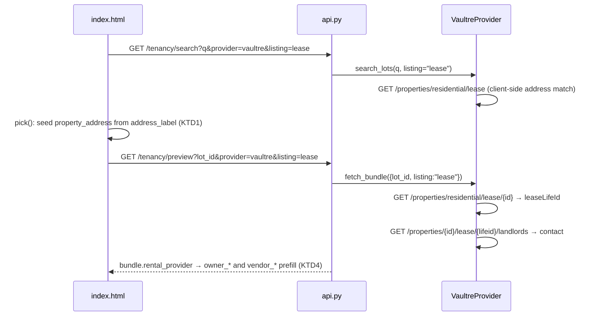

# fix: Property/vendor autopopulation for exclusive leasing authority and sales forms

## Summary

Entering a property on the PM exclusive leasing authority form populates nothing, for both the gea_crm and vaultre providers; the two sales forms partially share the failure. Three independent defects stack: the picked search result's address is discarded instead of seeding `property_address`; VaultRE only searches *sale* listings and requires a `saleLifeId` (a property being leased has neither), while gea_crm requires a *current tenancy* (a new leasing authority is pre-tenancy); and the leasing authority's fields are `owner_*` while the frontend prefill only fills `vendor_*`. This plan fixes all three: seed the address from the picked match unconditionally, extend the VaultRE provider with lease-side search and landlord fetch (endpoints confirmed in the public swagger spec), and alias the `owner_*` fields in the prefill map.

---

## Problem Frame

- **R1.** Picking a property from search must populate `property_address` on every form that declares it, even when the bundle fetch subsequently fails.
- **R2.** The PM exclusive leasing authority must autopopulate owner details (`owner_names`, `owner_address`) from VaultRE via its lease-side endpoints when a lease listing exists.
- **R3.** VaultRE search for PM-category forms must query lease listings, not sale listings.
- **R4.** Sales forms (`allmain_letter_of_offer`, `reiv_exclusive_sale_authority`) keep their existing sale-side vendor flow, and also gain the R1 address seeding.
- **R5.** All 17 bundle-required forms remain unaffected (regression boundary).

## Scope Boundaries

**In scope:** frontend seeding/aliasing (`static/index.html`), VaultRE provider lease-side support (`providers/vaultre.py`), API pass-through if needed, tests.

**Out of scope / deferred to follow-up work:**
- gea_crm pre-tenancy owner lookup (its `/api/forms/tenancy-bundle` endpoint is tenancy-keyed; a property-keyed owner endpoint is a GEA_crmAI-side change).
- Live verification of VaultRE response shapes — `VAULTRE_BEARER_TOKEN` is still pending issuance; parsing stays defensive as in the existing sale-side implementation.
- Provider-routing UI redesign (the `requires_identifiers === false → vaultre` heuristic stays; only the lease/sale mode within VaultRE changes).

---

## Key Technical Decisions

- **KTD1.** Seed `property_address` from `LotMatch.address_label` inside `pick()`, independent of bundle success. Rationale: the address is already known at pick time; discarding it is the cheapest defect to fix and covers every failure mode downstream.
- **KTD2.** (session-settled: user-directed — chosen over plumbing-only fix: user confirmed full lease-side support) Extend `VaultreProvider` with a lease mode: search `/properties/residential/lease`, fetch bundle via `leaseLifeId` → `GET /properties/{id}/lease/{lifeid}/landlords` → `GET /contacts/{id}`. Endpoints confirmed present in `vaultre_v1_2.yaml` (paths at lines ~5842, landlords sub-resource mirrors the sale-side owners pattern).
- **KTD3.** Mode selection: pass the form's category (sales vs pm) through the existing search/preview API calls as a query param (e.g. `listing=sale|lease`), defaulting to `sale` for backward compatibility. The frontend already knows the form spec at search time. Alternative rejected: searching both sale and lease listings on every query — doubles API calls and can surface the wrong life for a property that is both listed and managed.
- **KTD4.** Field aliasing: extend the sales prefill map so `rental_provider.*` also populates `owner_names`/`owner_address` (and `owner_phone`/`owner_email` if the spec declares them) when present on the form. Keep `vendor_*` mappings unchanged.

---

## High-Level Technical Design

Prose is authoritative; the diagram summarises the lease-mode path only — the sale-mode path is the existing flow.

---

## Implementation Units

### U1. Seed property_address from the picked search match

**Goal:** The address the PM picked is never thrown away (R1).
**Requirements:** R1, R4.
**Dependencies:** none.
**Files:** `forms_fill/forms_fill/static/index.html`.
**Approach:** In `pick()` (~line 875), after setting the search input, also set the `property_address` field input when the current form spec declares it. Bundle-driven prefill may later overwrite it with a richer value; that is fine.
**Test scenarios:**
- Pick a match on the leasing authority form with the preview endpoint stubbed to 404 → `property_address` holds the match's address label.
- Pick a match on a sales form with a successful preview → `property_address` holds the (bundle-derived or label) address, not blank.
- Bundle-required form (e.g. CAV notice) → no `property_address` field exists; `pick()` does not error.
**Verification:** Manual browser check on the leasing authority form with provider errors; existing static-page tests still pass. (Frontend is a static single file with no JS test harness — verification is smoke-first. Execution note: prefer runtime smoke over introducing a JS test framework.)

### U2. VaultRE lease-mode search and bundle fetch

**Goal:** VaultRE can find lease listings and return landlord contact details (R2, R3).
**Requirements:** R2, R3; KTD2, KTD3.
**Dependencies:** none.
**Files:** `forms_fill/forms_fill/providers/vaultre.py`, `forms_fill/tests/test_vaultre.py`.
**Approach:**
1. Add a `listing` parameter (`"sale"` default | `"lease"`): for `fetch_bundle`, carry it inside the existing identifiers dict; for the search path, add a defaulted keyword parameter `listing: str = "sale"` to the base `search_lots` signature (`providers/base.py`) that non-VaultRE providers accept and ignore — the search path has no identifiers dict, and an unconditional kwarg from the API layer must not break gea_crm/propertyme search.
1b. Raw VaultRE lease/landlord/contact response bodies must never be logged (including during the post-token smoke test) — log only status codes, ids, and field-presence booleans; landlord contact details are personal data landing in Railway logs otherwise.
2. Lease search: `GET /properties/residential/lease`, same client-side address matching as sale.
3. Lease bundle: property detail from `/properties/residential/lease/{id}` → `leaseLifeId` → `GET /properties/{id}/lease/{lifeid}/landlords` → resolve contact via `/contacts/{id}` if the entry is an id reference; map through the existing `_rental_provider_from_contact`. No `leaseLifeId` or no landlords → `TenancyNotFoundError` (same "Add manually" degradation as sale mode).
**Patterns to follow:** the sale-side `fetch_bundle`/`_get_owners` implementation in the same file (commit 8887684) — mirror its defensive parsing and error mapping exactly.
**Test scenarios:**
- Lease search returns matches from the lease endpoint, not the sale endpoint (assert on requested URL).
- Lease bundle happy path: property with `leaseLifeId`, one landlord with full contact → mapped `RentalProvider` fields.
- Landlord returned as bare id reference → resolved via `/contacts/{id}`.
- Property with no `leaseLifeId` → `TenancyNotFoundError`.
- Empty landlords list → `TenancyNotFoundError`.
- Default (no `listing` key) still uses sale endpoints — regression guard for sales forms.

### U3. API pass-through for listing mode

**Goal:** Frontend can request lease mode (KTD3).
**Requirements:** R2, R3.
**Dependencies:** U2.
**Files:** `forms_fill/forms_fill/api.py`, matching test file (e.g. `forms_fill/tests/test_api.py`).
**Approach:** Accept an optional `listing` query param on `/tenancy/search` and `/tenancy/preview`; pass it into `search_lots`/`fetch_bundle` identifiers. Default absent → current behaviour. Invalid values return 400 `invalid_request`, matching the endpoints' existing validation style — coercing to sale would silently query the wrong life.
**Test scenarios:**
- `listing=lease` reaches the provider call arguments.
- Absent param → provider called exactly as today.
- Invalid value (e.g. `listing=banana`) → 400 `invalid_request`.

### U4. Frontend lease routing and owner_* prefill aliases

**Goal:** The leasing authority form requests lease mode and its owner block populates (R2; KTD4).
**Requirements:** R2, R4.
**Dependencies:** U1, U3.
**Files:** `forms_fill/forms_fill/static/index.html`.
**Approach:**
1. When the active form is PM-category with `requires_identifiers === false` (currently only `pm_exclusive_leasing_authority` — key on the registry category already exposed to the UI, not a hardcoded form key), append `listing=lease` to search/preview calls.
2. Extend `SALES_VENDOR_SOURCE_FIELDS`/`prefillSalesFields` with `owner_names`, `owner_address` (+ phone/email if declared) sourced from the same `bundle.rental_provider` paths as their `vendor_*` twins.
**Test scenarios:**
- Leasing authority form: stubbed lease bundle → `owner_names`, `owner_address`, `property_address` populated.
- Sales form: vendor fields populate exactly as before (regression).
- Verification is smoke-first per U1's execution note.

---

## Risks & Dependencies

- **Live shape unverified:** `VAULTRE_BEARER_TOKEN` is still pending from VaultRE, so neither sale- nor lease-side responses have round-tripped live. Mitigation: defensive parsing mirrored from the sale side, and a documented smoke test the moment the token lands (both modes).
- **gea_crm remains structurally unable** to serve pre-tenancy owner data — out of scope here; the "Add manually" fallback stays correct for it. A follow-up GEA_crmAI endpoint (property-keyed owner lookup) would close this.
- **Dual-life properties** (listed for sale and lease simultaneously): mode is chosen by form category, so the correct life is queried; no cross-contamination expected.

## Definition of Done

- Picking a property seeds `property_address` on all three `requires_identifiers === false` forms even when the bundle fetch fails.
- The leasing authority form autopopulates owner name/address from a stubbed VaultRE lease bundle end-to-end (search → pick → preview → prefill).
- Sales-form vendor flow and all 17 bundle-required forms unchanged (full test suite green).
- All new provider/API behaviour covered by the enumerated unit tests; suite passes.
- A written smoke-test checklist (both sale and lease modes) is committed and linked as the blocking follow-up for when `VAULTRE_BEARER_TOKEN` arrives — stubbed-green is not live-verified.
- gea_crm-routed leasing-authority flows show the seeded address plus the "Add manually" owner fallback; the property-keyed owner lookup follow-up is filed against GEA_crmAI (owner details on gea_crm remain manual until it ships — half the reported failure survives on that provider by documented deferral).
