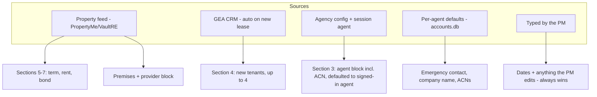

# Lease Agreement Fill Speed-Up - Plan

## Goal Capsule

- **Objective:** cut the clicks and typed fields needed to complete a lease agreement (residential rental agreement) fill, from ~13 clicks + 11–22 typed fields today to roughly half, without changing the flow's shape (lease type → property → details → review → generate).
- **Authority:** this plan; the origin autofill plan's standing KTDs (`docs/plans/2026-07-28-001-feat-rental-agreement-autofill-review-plan.md`) — especially autofill-as-defaults (its KTD4) and spec-driven field metadata (its KTD7).
- **Stop conditions:** stop and surface if a change would compute a date, notice period, or legal value (product rule, R6 below); or would remove the review-before-generate step.
- **Execution profile:** single repo (`forms_fill/`), UI + API + one small schema addition; every unit independently landable.

---

## Product Contract

### Summary

Make each pass through the lease agreement flow shorter: the signed-in agent becomes the default handling agent, new-lease tenant fetch runs automatically instead of via a second manual search, the agent's own recurring values persist as per-agent defaults, and the duplicate lease-type control disappears. The review step and the no-computed-dates rule are untouched.

### Problem Frame

A typical new-lease fill costs ~13 clicks and 11–22 typed fields. Audit findings (2026-08-26, against `forms_fill/forms_fill/forms/residential_rental_agreement/spec.py` and `forms_fill/forms_fill/static/index.html`):

- `handling_agent` defaults to `officeData.agents[0]`, so every agent except the first re-picks themselves on every single fill — and until they do, the whole agent block (name/phone/email) is wrong.
- The property address is searched twice on a new lease: once against the provider, then again inside the manual "autopopulate from GEA CRM" link.
- `agent_acn`, `provider_company_name`, `provider_acn`, and the three emergency-contact fields are typed every time despite being near-constant for a given agent/office.
- New lease vs renewal is expressed twice (section-2 radio and the `is_renewal` checkbox in section 3, kept in sync by two listeners).
- The CRM renter fetch caps at 2 renters while the form declares 4.

### Requirements

**Fewer corrections**

- R1. The signed-in agent is the default handling agent; the agent block (name, phone, email, ACN) is correct on first render without a picker interaction. Machine-token and dev-bypass sessions keep the current first-agent default.
- R2. `agent_acn` seeds from the agency config like the rest of the agent block.

**Fewer manual steps**

- R3. On a new lease, once the property preview is fetched, the GEA CRM renter lookup runs automatically and seeds renter details (up to 4 renters); the manual link remains as a visible retry/fallback and a CRM miss is a quiet hint, never an error. While the lookup is in flight the UI shows a pending state (the existing link text becomes "Checking GEA CRM…"); per R8, a value typed during the fetch is never replaced by the late-arriving seed.
- R4. The lease type is expressed through one control: the section-2 radio. The `is_renewal` caller field stays in the API contract but no longer renders as a separate checkbox.

**Recurring values persist**

- R5. Per-agent defaults: values the agent supplies for near-constant fields (emergency contact name/phone/email, `provider_company_name`, `provider_acn`, `agent_acn`) are remembered per account and seeded on the next fill, editable as always, tagged with their source.

**Unchanged product rules**

- R6. The tool still never computes dates, notice periods, or legal values — all date fields remain typed. (session-settled: user-approved — kept over auto-suggested dates such as end = start + 12 months.)
- R7. The review-before-generate step is retained. (session-settled: user-approved — kept over one-click generate.)
- R8. Seeded values are defaults, never overrides: a typed value always wins, per the origin plan's autofill rule.

### Scope Boundaries

- **Deferred to Follow-Up Work:** consolidating the duplicated agent-block seeding rule (server `apply_agent_autofill` + client `applyAgentAutofill` implement the same logic and can drift) — worthwhile refactor, not needed for speed; reordering the review screen (blanks-first grouping); renter current-address sourcing (no data source exists, stays manual by origin R13).
- **Out of scope:** other forms' flows (changes land where the mechanism is shared, but no per-form tuning); e-signature and drafts features; Hermes machine-caller contract changes beyond R1's carve-out.

---

## Planning Contract

### Key Technical Decisions

- KTD1. **Per-agent defaults live server-side in `accounts.db`, not localStorage.** (session-settled: user-approved — chosen over localStorage: agents share machines and accounts already exist.) A new `agent_defaults` table `(agent_id, form_key, values TEXT json, updated_at)` in `forms_fill/forms_fill/accounts.py`, mirroring the drafts table's ownership pattern (`agent_id IS ?` in every clause; machine token uses the NULL bucket). A dedicated table over a reserved drafts row: drafts are user-visible and deletable in the UI, defaults must not appear in the In-progress list.
- KTD2. **Defaults are captured at generate time, not saved explicitly.** When a fill succeeds, the client posts the current values of the rememberable field names for that form key. No "save my defaults" button — the last successful fill is the memory. Rememberable names are a small allowlist (R5's list), not every caller field: remembering rent or dates would seed one tenancy's data into another's form.
- KTD3. **The signed-in agent reaches the client via the existing `/agency` payload.** `GET /agency` adds a `me` key (the session agent's name/email matched against the configured agents list) resolved server-side from the bearer token; `applyAgentAutofill` prefers `me` over `agents[0]`. Machine token yields no `me` → current behaviour. This is the one-line-ish shape the audit identified; no new endpoint.
- KTD4. **Auto CRM fetch is a triggered call to the existing `fetchCrmTenants`, not new fetch logic.** The trigger is a condition, not an event: whenever (successful preview AND New lease selected) becomes true and no fetch has run for the current picked address, fire once — so it fires on preview when New lease is already chosen, AND on switching the radio to New lease when a preview already exists. A new preview resets the guard; switching to Renewal and back does not re-fire. The in-preview link stays for manual retry; failures downgrade to the existing hint text. Auto-seeded renter fields go through the same tagged-seed path (`seedField(..., 'GEA CRM')`) as every other seeder. Renter cap rises from 2 to 4 in the one `slice` and the seeding loop.
- KTD5. **The `is_renewal` checkbox is hidden, not removed from the spec.** The field stays in `caller_field_labels` (machine callers and `/fill` payloads depend on it, including Hermes renewals) but gains a `hidden` presentation kind the renderer skips; the radio remains the writer of its value. This keeps the API contract stable while deleting the duplicate control.

### Assumptions

- The configured agents in `fixtures/gea_agency.json` (or `FORMS_AGENCY_FILE`) carry emails matching agents' account emails, so `me` matching by email works; fall back to name match, then no default change.
- Per-agent defaults per form key (not global) — the same agent may want different constants on different forms.

### High-Level Technical Design

Where each lease-agreement field's value comes from once this lands:

---

## Implementation Units

### U1. Signed-in agent becomes the handling-agent default

- **Goal:** the agent block is correct on first render for the logged-in agent (R1), and `agent_acn` seeds with it (R2).
- **Requirements:** R1, R2, R8.
- **Dependencies:** none.
- **Files:** `forms_fill/forms_fill/api.py` (`/agency` route), `forms_fill/forms_fill/agency.py` (expose per-agent `acn` if present in config), `forms_fill/forms_fill/forms/residential_rental_agreement/spec.py` / `forms_fill/forms_fill/forms/_rental_agreement_shared.py` (add `agent_acn` to the seeded agent fields), `forms_fill/forms_fill/static/index.html` (`applyAgentAutofill` prefers `me`), `forms_fill/tests/test_agency_me.py` (new).
- **Approach:** per KTD3 — `/agency` resolves the session agent and returns `me`; client and server agent-autofill both prefer it; `agent_acn` joins the seeded set on both sides.
- **Test scenarios:**
  - Session token for an agent whose email matches a configured agent → `/agency` returns that agent as `me`.
  - Machine token → no `me` key; existing `agents[0]` behaviour asserted unchanged.
  - Session agent not in the configured list → no `me`, no error.
  - `build_context` with blank `agent_acn` seeds it from config; caller-supplied value wins.
- **Verification:** signed in as a non-first agent, the rendered form shows that agent's details without touching the picker.

### U2. Auto-run GEA CRM tenant fetch on new-lease preview

- **Goal:** new tenants appear without the second manual search (R3), up to 4 renters.
- **Requirements:** R3, R8.
- **Dependencies:** none.
- **Files:** `forms_fill/forms_fill/static/index.html` (`renderPreview` / `fetchCrmTenants`).
- **Approach:** per KTD4 — after a successful preview with the lease form + New lease selected, call `fetchCrmTenants()` once; guard against double-fire on re-fetch; raise the renter cap to 4. Client-only change.
- **Test scenarios:** Test expectation: none — client-only behaviour with no server change; covered by the existing `node --check` gate and U5's manual pass.
- **Verification:** manual: new-lease fetch on a property with CRM tenants seeds section 4 without clicking the link; a CRM miss shows the hint and the link still works as retry.

### U3. Per-agent sticky defaults

- **Goal:** near-constant fields fill themselves from the agent's last successful fill (R5).
- **Requirements:** R5, R8.
- **Dependencies:** U1 (source-tag conventions), U2 landed first only for cleaner manual verification — no hard dependency.
- **Files:** `forms_fill/forms_fill/accounts.py` (`agent_defaults` table + get/save), `forms_fill/forms_fill/api.py` (`GET/POST /defaults/{form_key}`), `forms_fill/forms_fill/static/index.html` (`applyRememberedDefaults()` seeder in `renderCallerFields`, capture on fill success), `forms_fill/tests/test_accounts.py` (extend).
- **Approach:** per KTD1/KTD2 —
  1. Table + accessors follow the drafts ownership pattern exactly.
  2. Endpoints reuse `_require_auth` and `_draft_agent_id`.
  3. The client seeds via the existing `seedField(name, value, 'your defaults')` so stickiness and source tags come free; seeded values are assigned via element `.value`/`textContent` only, never interpolated into markup. Capture posts the allowlisted names' current values after a successful `/fill`; a failed capture POST is silently ignored (fire-and-forget) — the fill's success UI is never affected.
  4. Server-side validation: values must be strings, each capped (500 chars); oversized or non-string values are dropped like non-allowlisted keys.
- **Test scenarios:**
  - Save defaults for form key → get returns them; another agent's get returns nothing.
  - Machine token uses the shared bucket.
  - Save with a second payload overwrites (upsert, no duplicates).
  - Allowlist enforcement server-side: non-allowlisted keys in the payload are dropped, not stored.
  - Value validation: non-string or over-cap values are dropped, not stored.
- **Verification:** fill once with emergency contact typed; reload; new fill shows those values tagged "from your defaults", editable.

### U4. Single lease-type control

- **Goal:** New lease / Renewal is chosen exactly once (R4).
- **Requirements:** R4.
- **Dependencies:** none.
- **Files:** `forms_fill/forms_fill/formspec.py` or the renderer in `forms_fill/forms_fill/static/index.html` (support a `hidden` caller-field kind), `forms_fill/forms_fill/forms/residential_rental_agreement/spec.py` (`is_renewal` kind → hidden), `forms_fill/tests/test_forms_catalogue.py` (extend).
- **Approach:** per KTD5 — the renderer skips hidden-kind fields; the radio listener keeps writing the DOM field's value (the hidden input still exists as a `[data-field]` carrier so drafts, review, and `/fill` payloads are unchanged).
- **Test scenarios:**
  - Catalogue still lists `is_renewal` with its kind so machine callers see the contract.
  - A `/fill` payload with `is_renewal: "true"` behaves exactly as before (regression, exists — assert unchanged).
- **Verification:** the section-3 checkbox is gone; toggling the radio still flips renewal seeding and the review screen shows the value.

### U5. End-to-end click-count check

- **Goal:** demonstrate the speed-up and catch interaction regressions.
- **Requirements:** all.
- **Dependencies:** U1–U4.
- **Files:** `docs/plans/2026-08-26-001-feat-lease-flow-speedup-plan.md` (record the measured counts in the PR description, not the plan), no code.
- **Approach:** repeat the audit's action walk on the deployed or locally-run app as the second-listed agent: new lease, CRM-known property. Count clicks and typed fields; compare against the ~13 / 11–22 baseline.
- **Test scenarios:** Test expectation: none — manual verification unit.
- **Verification:** clicks and typed fields both materially down (target: no picker correction, no second search, ≤6 typed fields when CRM and defaults cover their sets); nothing in the origin plan's review flow broken.

---

## Verification Contract

| Gate | Command | Applies to |
|---|---|---|
| Full test suite | `.venv/bin/python -m pytest tests -q` (from `forms_fill/`) | U1, U3, U4 |
| Page script syntax | `node --check` on the inline script of `forms_fill/forms_fill/static/index.html` | U1–U4 |
| Manual flow walk | signed-in new-lease fill against a CRM-known property | U2, U5 |

---

## Definition of Done

- All five units landed; full pytest green; `node --check` clean.
- Signed in as a non-first agent: agent block correct with zero picker interactions; CRM tenants seeded with zero extra searches; emergency-contact and ACN fields pre-filled from defaults after one prior fill; one lease-type control.
- Review step and no-computed-dates rule demonstrably unchanged.
- No abandoned experimental code in the diff.
