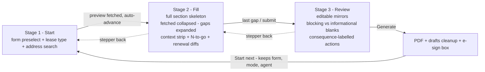

# feat: Guided lease-entry flow — fast property-manager data entry

## Goal Capsule

Redesign the forms-fill data-entry experience as a three-stage guided flow so a property manager completes a residential rental agreement with the minimum typing, clicks, and cognitive load — using the lease agreement as the exemplar, structured so other forms can adopt the same pattern. Design was reviewed on paper by three user-experience persona reviewers (busy PM, first-week admin, batch power-user); their converged findings are baked into the requirements below.

---

## Product Contract

### Summary

Today the lease fill is one long page of ~44 fields. It works, but entry speed depends on the user knowing the page. The guided flow splits work into three stages — **Start** (form + lease type + address), **Fill** (one stable, section-structured screen where fetched data is collapsed and the user is steered gap-to-gap), **Review & generate** (existing editable review, plus a fast next-lease loop) — while deliberately rejecting two classic wizard patterns the persona reviews killed: a separate "confirm fetched data" step (rubber-stamp click) and a "show only blank fields" screen (hides stale-but-wrong fetched values, breaks muscle memory).

### Problem Frame

- Entry speed is limited by scanning a 44-field page, not by the autofill (which is now good after the 2026-08-26 speed-up).
- The dangerous errors are not blanks (review catches those) but stale fetched values — old rent on a renewal, ex-tenants — which nothing currently draws the eye to.
- Novices stall on jargon fields and the new/renewal fork; batch users lose time to per-lease restart overhead.

### Requirements

- **R1** Entry is a three-stage flow: Start → Fill → Review. A visible stepper allows moving back; no stage adds a mandatory click that only confirms already-correct data (no standalone "Looks right" step).
- **R2** Start stage: form preselected to the last-used form, lease-type toggle with one-line plain-English helper text (renewal = same renters, same property), address search focused on load. A tenancy preview that returns a usable bundle (for a renewal: at least one renter) auto-advances to Fill; a failed or empty preview stays on Start with the error shown inline, and a "Continue without CRM data" action always allows advancing to Fill with all fields as blanks — today's fully manual entry path is preserved.
- **R3** Fill stage renders the **full stable section skeleton** every time (constant field order for muscle memory): fetched/defaulted fields collapsed into compact rows with source tags, manual/blank fields expanded; a "N to go" counter and a next-gap jump steer the user between gaps.
- **R4** A pinned context strip (premises, rent, term dates, renter names) stays visible during Fill so date and money questions are never answered blind.
- **R5** On a renewal, the renewal-critical fields (rent, bond, renters) carry a "verify against the new agreement" prompt while still holding their seeded values, and once the user edits one it shows a persistent changed marker with both values ("was $520, now $540") — the marker includes a text badge, never colour alone. (Term dates are always user-entered on renewals, so they render as ordinary gaps, not diffs.)
- **R6** Manual edits always win: a per-field refetch or a draft-resume re-seed never silently overwrites a hand-edited value — a diff chip shows both values ("PropertyMe says $520 — you entered $540") and the user picks.
- **R7** Always-manual fields carry one-line inline help with a real example/format (e.g. bond lodgement number format, urgent-repairs nominee); the new/renewal toggle carries its helper per R2.
- **R8** Date entry: hard inline validation (parseable date, end after start) blocks advancing; an advisory echo restates the entered term in words ("ends Tue 8 Sep 2026") — echoing input is allowed, computing dates remains prohibited (existing no-computed-dates rule).
- **R9** Keyboard-first: Enter advances gap-to-gap in Fill (blocked by invalid input per R8), the last gap advances to Review, and Review's confirm-and-generate is reachable without the mouse. Every stage boundary has a keyboard path.
- **R10** Review stage keeps the existing editable-mirror review (any field fixable without stepping back), splits blank-field warnings into **blocking** (agreement incomplete) vs **informational** (commonly blank), and labels action consequences on the buttons ("Generate PDF — nothing is sent to anyone"; "Send for e-signing — emails the renters").
- **R11** After generation, a "Start next" action opens a fresh Start stage preserving form, lease-type, and agent, with the cursor in address search — one action from finished lease to typing the next address.
- **R12** Drafts persist the stage and focused field; resuming lands the user on the exact field with a "last saved …" note. Existing autosave cadence unchanged.
- **R13** The stage framework is generic over the form catalogue's section metadata: the lease agreement opts in; forms without section metadata keep the current single-page behaviour unchanged.

### Scope Boundaries

**In scope:** the registered residential rental agreement form as the exemplar (a future 5-year variant, when built, opts in via the same guided flag); the generic stage framework; client-side UI in `forms_fill/forms_fill/static/index.html`; small server additions only where the client needs data (previous-agreement values for R5, catalogue metadata for R13, field help text).

**Out of scope:** new form types; e-sign flow changes beyond button labelling; CRM/provider API changes; visual re-theme.

### Deferred to Follow-Up Work

- Batch rail (persistent sidebar of today's leases with status) and paste-a-list multi-address queueing — batch persona items 5 and 9.
- CRM data-freshness stamps ("last updated in CRM on …") — needs provider metadata not currently in the bundle contract.
- "Flag for someone to check" escalation on a field/draft — novice persona item 7.
- Ctrl+1–4 stepper shortcuts and documented refetch shortcut.
- Rolling the wizard pattern out to other forms (the framework makes it a per-spec opt-in later).

---

## Planning Contract

### Key Technical Decisions

1. **KTD1 — Extend the existing single-page IIFE, not a rewrite.** The stage framework is a presentation layer over the existing `renderCallerFields` DOM: stages show/hide section groups, so autosave, drafts, source tags, per-field refetch, and the review screen all keep working. (Chosen over a new SPA/framework: no build step exists and the whole UI is one file.)
2. **KTD2 — Stages derive from `caller_field_sections`.** The catalogue already publishes per-field sections for the lease forms; the Fill stage's skeleton and gap-navigation iterate that same metadata. Non-declaring forms fall back exactly as `test_forms_catalogue.py` specifies (R13).
3. **KTD3 — No separate confirm step** (session-settled: persona-review-directed — chosen over the 4-step confirm wizard: all three reviewers independently identified it as a rubber-stamp click that reduces real verification).
4. **KTD4 — Full skeleton with collapsed fetched rows, not blanks-only** (session-settled: persona-review-directed — chosen over rendering only blank fields: stable order preserves muscle memory and keeps stale fetched values on the working surface).
5. **KTD5 — Renewal change-highlighting is an entered-vs-fetched diff, computed client-side.** The bundle's lease record is the same record that seeds the fields, so a fetched-vs-previous comparison is empty by construction (doc-review finding, two reviewers). Instead: renewal-critical fields prompt "verify against the new agreement" while untouched, and show a "was X, now Y" marker once edited. No provider or preview-payload changes. A true previous-vs-new-lease diff needs a second data source and is deferred (see Assumptions).
6. **KTD6 — Draft state gains `stage` and `focus` keys inside the existing opaque JSON blob** — no SQLite schema change.
7. **KTD7 — Field help text lives in the form spec** (a `caller_field_help` map published through the catalogue like kinds/sections), so help is per-form data, not hardcoded client strings.

### Assumptions

- A richer renewal diff (previous lease vs newly negotiated lease) requires a second data source — e.g. the provider exposing both expiring and new lease terms — and is deferred; R5's entered-vs-fetched marking is what ships now.
- Click-count baseline from the 2026-08-26 plan (~13 clicks) is the number to beat; target for a CRM-known renewal is ≤8 interactions to reach Review.

### High-Level Technical Design

State: one client-side `stage` variable drives visibility of the three stage containers; all existing form inputs stay in the DOM at all times (autosave and `/fill` submission unchanged). Gap navigation maintains an ordered list of unfilled expanded fields recomputed on input.

---

## Implementation Units

### U1. Generic stage framework and stepper

- **Goal:** three stage containers, stepper UI, stage state in the IIFE, opt-in per form.
- **Requirements:** R1, R13.
- **Dependencies:** none.
- **Files:** `forms_fill/forms_fill/static/index.html`, `forms_fill/forms_fill/formspec.py`, `forms_fill/forms_fill/registry.py`, `forms_fill/tests/test_forms_catalogue.py`, `forms_fill/tests/test_ui_routes.py`.
- **Approach:** add a `guided: true` flag to the registered residential rental agreement `FormSpec`, published via `form_catalogue()`. In the client, when the selected spec is guided, wrap the existing sections into Start/Fill/Review containers and show the stepper; otherwise render exactly as today. Stage switching is show/hide — no re-render, no input teardown.
- **Patterns to follow:** `caller_field_kinds`/`caller_field_sections` catalogue publication and its fallback tests.
- **Test scenarios:**
  - Catalogue publishes `guided` for the rental agreement spec and omits/falsy for others.
  - Non-guided form renders with no stepper markup active (fallback behaviour preserved).
  - UI page contains stepper elements and three stage containers (string assertions in `test_ui_routes.py` style).
- **Verification:** full pytest green; `node --check` on the inline script; non-lease forms visually unchanged.

### U2. Start stage

- **Goal:** one screen to begin a lease: last-used form preselected, lease-type toggle with helper text, address search focused, auto-advance on successful preview.
- **Requirements:** R2.
- **Dependencies:** U1.
- **Files:** `forms_fill/forms_fill/static/index.html`, `forms_fill/tests/test_ui_routes.py`.
- **Approach:** persist last-used form key in localStorage; move `#lease-mode` radios and the search box into the Start container with one-line plain-English helper under the toggle; on `fetchPreview()` success with a usable bundle (renewal: at least one renter), advance to Fill automatically after `maybeAutoCrmFetch` fires. On preview failure, empty result, or an unusable bundle, stay on Start with the existing error/summary shown inline. A visible "Continue without CRM data" action always advances to Fill with all fields expanded as blanks (preserves today's fully manual path). Changing the address or lease type via the stepper after Fill has data prompts before re-seeding, and hand-edited fields are kept per R6.
- **Test scenarios:**
  - Helper text present near the lease-mode control.
  - Preview success path advances stage (assert the advance call is wired in the submit/preview handler).
  - "Continue without CRM data" control exists and advances without a preview.
  - `requireLeaseMode()` gate still blocks search until a mode is chosen.
- **Verification:** manual: cold load → cursor in address box after form preselect; renewal and new-lease both advance to Fill after preview.

### U3. Fill stage — stable skeleton, gap navigation, context strip, renewal diffs

- **Goal:** the core entry screen embodying KTD3/KTD4.
- **Requirements:** R3, R4, R5, R6.
- **Dependencies:** U1, U2.
- **Files:** `forms_fill/forms_fill/static/index.html`, `forms_fill/tests/test_ui_routes.py`.
- **Approach:**
  1. Render all sections in fixed order; a field whose value was seeded from fetch/defaults renders as a collapsed compact row (label + value + source tag + expand-to-edit); blank/manual fields render expanded.
  2. "N to go" counter reuses `updateProgress()` data; a next-gap button/Enter target focuses the next expanded blank.
  3. Context strip pinned atop the Fill container showing premises, rent, term dates, renter names, updating live.
  4. Renewal marking (KTD5, client-side only): on a renewal, rent/bond/renter fields render a "verify against the new agreement" prompt while their value still equals the seeded value; once edited, show a persistent "was X, now Y" marker with a text badge (not colour alone). No server change.
  5. Manual-edit precedence: `forceFetchField` on a field whose `fieldSource` is manual shows a diff chip with both values instead of overwriting — two keyboard-focusable buttons ("Keep $540" / "Use $520") in the gap order; choosing either dismisses the chip and sets the field source.
  6. Accessibility: collapsed rows are focusable buttons reachable in the Enter gap-run; the stepper marks the active stage with `aria-current`.
- **Test scenarios:**
  - Seeded field collapses; blank field expands (DOM class assertions via string tests where feasible).
  - Editing a collapsed row's value flips its source to manual and it stays expanded.
  - Refetch over a manually edited field does not overwrite the value (unit-testable in the JS-free layer only via string assertion on the guard; main coverage is the manual walk).
  - Renewal: rent/bond/renter fields carry the verify prompt; editing one produces the "was/now" marker (string assertions on the marking logic).
  - New lease: no verify prompts or changed markers.
- **Verification:** manual walk: on a renewal, editing the rent shows the "was/now" marker and untouched renewal-critical fields carry the verify prompt; overview of all sections reachable by scroll within Fill.

### U4. Field help and validation

- **Goal:** inline help for always-manual fields; hard date validation with advisory echo; blocking vs informational blank classification.
- **Requirements:** R7, R8, part of R10.
- **Dependencies:** U3.
- **Files:** `forms_fill/forms_fill/forms/residential_rental_agreement/spec.py`, `forms_fill/forms_fill/formspec.py`, `forms_fill/forms_fill/registry.py`, `forms_fill/forms_fill/static/index.html`, `forms_fill/tests/test_forms_catalogue.py`.
- **Approach:** add `caller_field_help` (KTD7) and a `caller_field_required` classification to the spec/catalogue; client renders help under expanded fields; date inputs validate on blur/Enter (parseable, end-after-start) and show a plain-words echo of the entered date — never a computed suggestion. Review's blank list splits by the required classification.
- **Test scenarios:**
  - Catalogue publishes help text and required classification for the rental agreement spec; absent for non-declaring forms (fallback test).
  - End-before-start term dates produce a blocking validation state.
  - Echo renders the typed date in words; no field is ever auto-populated by the echo.
  - Review blank list separates blocking vs informational (string assertions on the two list containers).
- **Verification:** pytest green; manual: half-typed date blocks Enter-advance with a visible message.

### U5. Keyboard flow and resume-to-field

- **Goal:** continuous keyboard run from address to PDF; drafts resume to the exact field.
- **Requirements:** R9, R12.
- **Dependencies:** U3, U4.
- **Files:** `forms_fill/forms_fill/static/index.html`, `forms_fill/tests/test_accounts.py` (the `/drafts` round-trip test of the extended blob is required; the server continues to treat the blob as opaque).
- **Approach:** Enter in a Fill field advances to the next gap (blocked by U4 validation); Enter on the last gap triggers the existing submit→review path; in Review, confirm checkbox and generate button are focus-ordered so Space+Enter completes. `draftState()` gains `stage` and `focus` (KTD6); `resumeDraft` restores both and shows a "last saved …" line.
- **Test scenarios:**
  - Draft JSON round-trips `stage`/`focus` through save/resume (pytest via `/drafts` with the extended blob — server treats it as opaque, so this is a client-contract string assertion plus an API round-trip test).
  - Resume with a stored focus lands on that field (manual).
  - Enter on an invalid date does not advance (manual + U4 unit).
- **Verification:** manual: full renewal completed hands-on-keyboard except address-result pick; interrupt mid-Fill, resume, land on the same field.

### U6. Review actions and next-lease loop

- **Goal:** consequence-labelled actions and the batch fast path.
- **Requirements:** R10, R11.
- **Dependencies:** U1, U2.
- **Files:** `forms_fill/forms_fill/static/index.html`, `forms_fill/tests/test_ui_routes.py`.
- **Approach:** relabel the review/result actions with explicit consequences; after a successful `/fill`, render "Start next" which resets tenancy/renter fields, keeps form key, lease mode, and agent selection, returns to Start with the search box focused. Existing `captureDefaults()` and draft-delete behaviour unchanged.
- **Test scenarios:**
  - Buttons carry the consequence labels (string assertions).
  - "Start next" preserves form key, lease mode, handling agent; clears premises/renter/lease fields (assert the reset function's field coverage against the spec's field list, e.g. a JS-side list mirrored in a pytest string check).
  - Generate still shows approve/e-sign boxes as today.
- **Verification:** manual: two renewals back-to-back — second lease reaches typing the address in one action from the first's result.

### U7. Test repair and end-to-end interaction count

- **Goal:** keep the string-matching UI test suite honest and prove the speed-up.
- **Requirements:** all.
- **Dependencies:** U1–U6.
- **Files:** `forms_fill/tests/test_ui_routes.py`, no production code.
- **Approach:** update the existing string assertions (`test_ui_page_contains_lookup_flow_elements`, review-screen and submit-gating tests) for the staged DOM; add assertions for the stepper, collapsed-row markup, context strip, and next-lease button. Then repeat the action walk from the 2026-08-26 plan as the signed-in second agent, for both a CRM-known new lease and a renewal; record counts in the PR description. **Counting rule:** one interaction = one click, one address-result pick, or one field's typed entry regardless of keystrokes; re-count the 2026-08-26 baseline under this same rule so baseline and target are commensurable.
- **Test scenarios:** Test expectation: none — this unit is the test work itself plus a manual verification unit.
- **Verification:** full pytest green; `node --check` clean; renewal reaches Review in ≤8 interactions and new lease does not regress from the current baseline; existing review flow, no-computed-dates rule, drafts, and e-sign all demonstrably unchanged.

---

## Verification Contract

| Gate | Command | Applies to |
|---|---|---|
| Full test suite | `.venv/bin/python -m pytest tests -q` (from `forms_fill/`) | U1–U7 |
| Page script syntax | `node --check` on the inline script of `forms_fill/forms_fill/static/index.html` | U1–U6 |
| Manual flow walk | signed-in renewal and new-lease fills against a CRM-known property, counting interactions | U2, U3, U5, U6, U7 |

---

## Definition of Done

- All seven units landed; pytest green; `node --check` clean.
- Renewal: Start → Review in ≤8 interactions (per U7's counting rule) with the verify prompts and was/now markers shown; new lease not regressed from the re-counted baseline.
- Non-guided forms render exactly as before (fallback tests green).
- No separate confirm step exists; Fill shows the full stable skeleton; manual edits survive refetch; drafts resume to the exact field.
- Review still gates generation behind the confirm checkbox; no-computed-dates rule intact (echo only).

---

## Sources & Research

- Repo research: current flow, field schema, and reuse surfaces in `forms_fill/forms_fill/static/index.html`, `forms/residential_rental_agreement/spec.py`, `registry.py`, `accounts.py` (this session).
- Origin baseline: `docs/plans/2026-08-26-001-feat-lease-flow-speedup-plan.md` (click baseline, no-computed-dates rule, sticky defaults).
- Persona reviews (paper, this session): **busy PM** — confirm step is a rubber stamp, blanks-only hides stale values, renewal diff highlighting, manual-edits-win, resume-to-field; **first-week admin** — new/renewal helper, per-field example help, blocking-vs-informational blanks, consequence labels; **batch power-user** — next-lease loop, continuous keyboard run, auto-skip confirm, stable field order, editable review without step round-trips. Deferred items retained under Scope Boundaries.

**Product Contract preservation:** n/a — bootstrap plan, no upstream requirements document.
